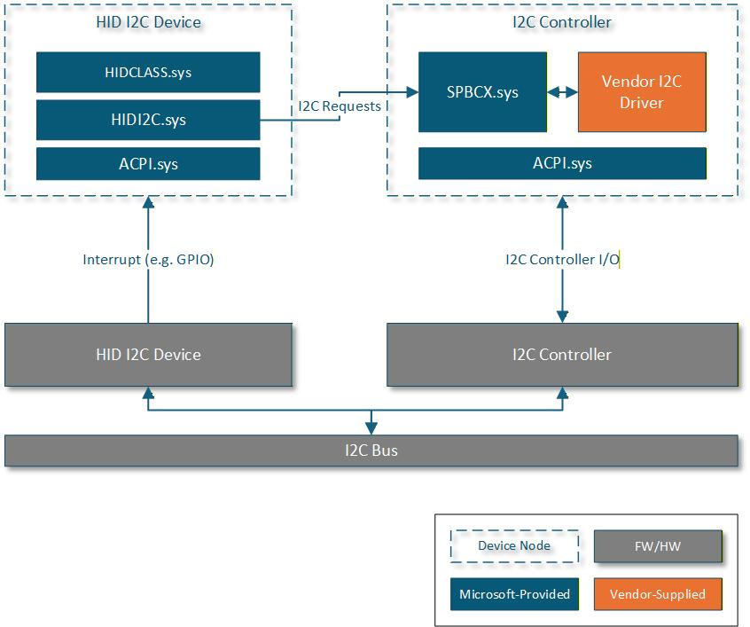
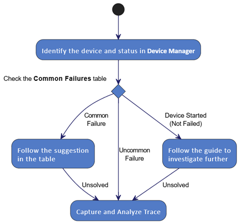
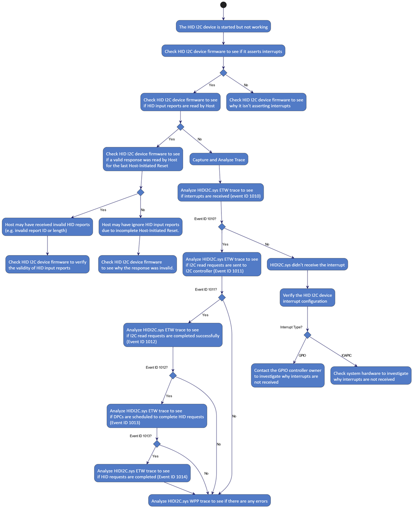
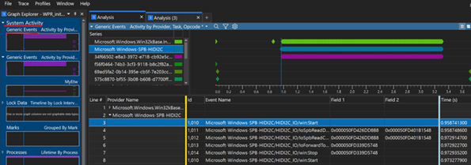
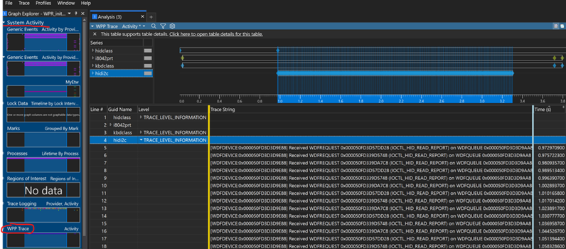
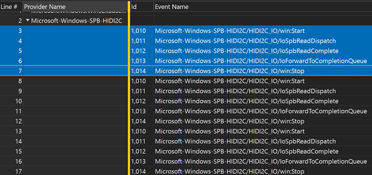
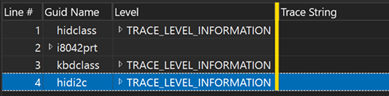
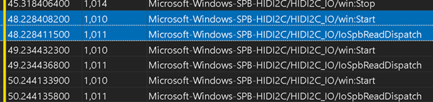
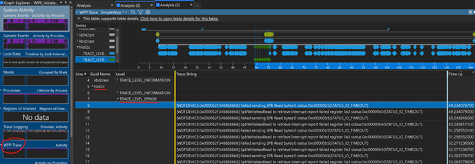
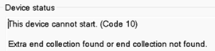

# Troubleshooting HID over I2C Device Issues

HID over I2C (a.k.a. HID I2C) devices — such as touchpads, touchscreens, sensors, and keyboards—are widely used in modern laptops and tablets for their low power consumption and flexible integration. Diagnosing and resolving their issues can be challenging due to the complexity of interactions between HID I2C device firmware, I2C controllers, and the operating system. This guide presents a structured workflow specifically for troubleshooting HID I2C device issue. By following these steps, engineers can efficiently isolate issues, capture meaningful traces, and communicate actionable findings to device manufacturers or controller vendors.

## Architecture and Overview

This diagram shows the typical architecture of a HID I2C device and a corresponding I2C controller.

This diagram shows an overview of this troubleshooting guide.

## Common Failures of HID I2C Devices

|Device Status|What Happened|What To Do Next|
| -------- | -------- | -------- |
|"A request for the HID descriptor failed."|The HID I2C device firmware failed processing the read request for the HID descriptor from the host.|Please contact the HID I2C device firmware owner to investigate the issue. If the HID I2C device firmware didn't receive the read request, please contact the I2C controller owner to investigate why the I2C controller didn't send the read request. If you need more information on the request failure, please follow the instructions in a later section to capture and analyze HIDI2C driver trace.|
|"The device returned an invalid HID descriptor."|The HID I2C device firmware returned an invalid HID descriptor to the host. The descriptor contains one or more invalid fields, such as an incorrect descriptor length, an invalid register address, etc. |Please contact the HID I2C device firmware owner to address the issue. If you need more information on the validation failure, please follow the instructions in a later section to capture and analyze HIDI2C driver trace.|
|"The device failed the SET_POWER command."|Writing the HID I2C command SET_POWER to the device firmware failed.|Please contact the HID I2C device firmware owner to investigate the issue. If the device didn't receive the write, please contact the I2C controller firmware owner to investigate why the I2C controller didn't write to the HID I2C device. If you need more info|
|"This device cannot start. (Code 10)" with a message that indicates a descriptor parsing failure. |The HID I2C device firmware returned an invalid HID Report descriptor.|Please contact the HID I2C device firmware owner to address the issue. Because the OS retrieves the HID Report Descriptor based on the information in the HID Descriptor it retrieves from the device firmware earlier, please make sure that in the HID Descriptor, both the wReportDescLength field at byte offset 4 and the wReportDescRegister field at byte offset 6 are accurate. An I2C bus analyzer hardware may be used to verify the actual descriptors transferred on the I2C bus. If you need more information on the descriptor validation failure, please follow the instructions |
|The HID I2C device is missing in Device Manager.|The ACPI firmware reported incorrect device configuration such as incorrect Compatible ID (_CID) or incorrect device presence status (_STA).|Please contact your ACPI firmware owner to inspect the device configuration.|

## HID I2C Device is Started in Device Manager (but not working)

Follow this flowchart to investigate further in this case.

## Capture and Analyze Trace for HID I2C Device Issues

### Capture Trace

Follow the instructions at [https://aka.ms/busestrace](https://aka.ms/busestrace) to get the __BusesTrace.cmd__ script and capture trace of Microsoft-provided drivers such as HIDI2C.SYS and HIDCLASS.SYS.

If there are multiple HID I2C devices, you may want to disable and/or avoid using them during the trace capture to reduce trace noise and make analysis easier.

### What Type of Trace to Capture

__BusesTrace.cmd__ can either capture an immediate repro trace, or configure the system for boot trace (but require a system reboot first after the script run). In most cases, especially for any device failures that happen during boot-up, a boot trace is required to capture the failure point.

### View HIDI2C.sys Manifested ETW Trace in WPA (Windows Performance Analyzer)

To view HIDI2C.sys manifested ETW trace in [Windows Performance Analyzer | Microsoft Learn](/windows-hardware/test/wpt/windows-performance-analyzer), open both __Buses-MachineInfo.etl__ and __WPR-…-*InputTrace.etl*_ files in WPA and choose to open them in one session.

Manifested ETW events can be viewed using the “System Activities\Generic Events” graph. The name of that HIDI2C event provider is “Microsoft-Windows-SPB-HIDI2C”. (This also works for other manifested ETW events as well, such as HIDCLASS manifested ETW events, which provider name is “Microsoft-Windows-Input-HIDCLASS”.)

### Common HIDI2C Manifested ETW Events

Event Provider Name: Microsoft-Windows-SPB-HIDI2C

|Event ID| Event Name |Meaning|
| -------- | -------- | -------- |
|1010 | Microsoft-Windows-SPB-HIDI2C/HIDI2C_IO/win:Start|HIDI2C.SYS receives an interrupt from the HID I2C device.|
|1011|Microsoft-Windows-SPB-HIDI2C/HIDI2C_IO/IoSpbReadDispatch|HIDI2C.SYS issues an I2C read request to the HID I2C device via the I2C controller.|
|1012|Microsoft-Windows-SPB-HIDI2C/HIDI2C_IO/IoSpbReadComplete|The I2C controller completes the I2C read request from HIDI2C.SYS successfully.|
|1013|Microsoft-Windows-SPB-HIDI2C/HIDI2C_IO/IoForwardToCompletionQueue|HIDI2C.SYS forwards a HID request to an internal I/O queue to complete with the HID I2C device data later.|
|1014| Microsoft-Windows-SPB-HIDI2C/HIDI2C_IO/win:Stop|HIDI2C.SYS completes a HID request with the HID I2C device data.|

### View HIDI2C.SYS WPP Trace in WPA

Unlike manifested ETW trace, WPP trace needs to be viewed using the "System Activity\WPP Trace" graph and also needs to load symbols to format the WPP trace messages with. For more information <ins>about</ins>~~of~~ configuring/loading symbols in WPA and the symbol path, please refer to the following documents.  (The same steps apply to any WPP trace, not just from HIDI2C.SYS.)

[Load Symbols or Configure Symbol Paths | Microsoft Learn](/windows-hardware/test/wpt/load-symbols-or-configure-symbol-paths)

[Loading Symbols | Microsoft Learn](/windows-hardware/test/wpt/loading-symbols)

Notes: The “__GUID Name__” field displays WPP trace providers, which are usually driver names such as “hidi2c”. But this column is not visible by ~~default, and~~<ins>default and</ins> needs to be added using the “View Editor” dialog box.

## Examples

### Example 1: (Non-Repro) Interrupts are Received and Handled Successfully.

HIDI2C manifested ETW trace shows expected event sequences from ID 1010, 1011, 1012, 1013 and 1014.

HIDI2C WPP trace, after grouped by provider names (the “Guid Name” column) and trace level, doesn’t show any errors (only Information level trace.)

### Example 2: Interrupts are Received ~~But~~<ins>but</ins> I2C Read Requests are Not Completed Successfully.

For each interrupt HIDI2C.SYS received, there should be the event sequence of ID 1010, 1011, 1012, 1013 and 1014. If ~~any of~~ event ID<ins>(s)</ins> 1011, 1012 or 1013 <ins>are </ins>~~is~~ missing like what this example shows, something went wrong, then WPP trace of HIDI2C.SYS can be analyzed further to see if there are more detailed errors logged.

HIDI2C manifested ETW trace shows events of ID 1010 and 1011 but not 1012 and others, which means that interrupts were received, I2C read requests were issued to the I2C controller but not completed successfully.

HIDI2C WPP trace, after grouped by the provider names (the “Guid Name” column) and trace level, shows that the SPB requests got timed out by the I2C controller. Further investigation from the I2C controller will be needed.

### Example 3: HID I2C Device Failed Due To Returning an Invalid HID Report Descriptor

In this example, the HID I2C device failed with the following status in Device Manager.

According to the Common Failures table above, this error status indicates that the HID I2C device firmware returned an invalid HID Report Descriptor. This issue should be investigated from the HID I2C device firmware first. You may want to verify that the expected HID Report Descriptor was returned. You may also use the I2C bus analyzer hardware to verify what was transferred on the I2C bus. If you need to get more information on this error, HIDCLASS.SYS trace, instead of HIDI2C.SYS trace, can be analyzed, since HID Report Descriptor is validated by HIDCLASS.SYS.

After grouped by trace level, HIDCLASS WPP trace shows the same error but with the byte offset showing where the error occurred.

