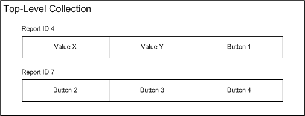

# Troubleshooting HID Reports

This section describes the following most common problems that user-mode applications and kernel-mode drivers might encounter when attempting to extract or set [HID usages](hid-usages.md):

[HID Report ID Errors](#hid-report-id-errors)

[Dropped HID Reports](#dropped-hid-reports)

###  HID Report ID Errors

When an application or driver receives a HID report from a HID collection, it can be any report that the collection contains (because a collection can return reports in any order). The **HidP\_Get***Xxx* routines return the following status values, which indicate report ID errors:

HIDP\_STATUS\_INCOMPATIBLE\_REPORT\_ID  
A requested usage is in a report supported by the HID collection, but not in the report that the application or driver specified.

HIDP\_STATUS\_USAGE\_NOT\_FOUND  
A requested usage is not in any report supported by the top-level collection.

For example, the following figure shows a HID collection that contains two reports.

Based on this example, assume an application or driver received a report from a collection and calls [**HidP\_GetUsageValue**](https://msdn.microsoft.com/library/windows/hardware/ff539748) to extract the current value of "Value X." If the report's ID is seven, the routine returns HIDP\_STATUS\_INCOMPATIBLE\_REPORT\_ID, which indicates that the device supports Value X, but that Value X is not present in the report. On the other hand, if the application or driver requests the value of "Value Z," the routine returns HIDP\_STATUS\_USAGE\_NOT\_FOUND, which indicates that Value Z is not in any report supported by the collection.

When an application or driver uses **HidP\_Set***Xxx* routines to set usages in a report, the routines can also return the same two status values. The meaning of HIDP\_STATUS\_USAGE\_NOT\_FOUND is the same as with the **HidP\_Get***Xxx* routines. However, the meaning of HIDP\_STATUS\_INCOMPATIBLE\_REPORT\_ID is different. This status value indicates that the report was previously configured with a report ID, and the usage specified by the caller does not belong to that report ID. Using the previous figure as an example, after an application or driver uses [**HidP\_SetUsages**](https://msdn.microsoft.com/library/windows/hardware/ff539792) to set "Button 2" in a zero-initialized report, the report is configured with a report ID of seven. If the application or driver subsequently attempts to use [**HidP\_SetUsageValue**](https://msdn.microsoft.com/library/windows/hardware/ff539797) to set "Value X" in the same report, the routine will return HIDP\_STATUS\_INCOMPATIBLE\_REPORT\_ID.

If a **HidP\_**<em>Xxx</em> routine returns HIDP\_STATUS\_INCOMPATIBLE\_REPORT\_ID, the caller should take one of the following actions:

-   If the caller is setting usages, it should allocate a new report of the correct length, zero-initialize it, and then call the routine again. The caller can send the report to the collection after successfully setting all usages in the report.

-   If the caller is extracting usages, it should call the routine with a different report obtained from the collection.

###  Dropped HID Reports

When the [HID Client Drivers](hid-client-drivers.md) obtains input reports from a HID collection, the reports are stored in a ring buffer maintained by the HID class driver. This mechanism reduces the possibility that an application or driver will miss input reports that it requires.

By default, the HID class driver maintains an input report ring buffer that holds 32 reports. If a collection transmits data to the HID class driver faster than a user-mode application or kernel-mode driver retrieves it from the buffer, input reports are lost because of buffer overflow. To reduce the possibility of buffer overflow, an application or driver can reconfigure the size, in number of reports, of the buffer. Drivers retrieve and change the size of the buffer by using an [**IOCTL\_GET\_NUM\_DEVICE\_INPUT\_BUFFERS**](https://msdn.microsoft.com/library/windows/hardware/ff541058) request and an [**IOCTL\_SET\_NUM\_DEVICE\_INPUT\_BUFFERS**](https://msdn.microsoft.com/library/windows/hardware/ff542087) request. Applications do the same operation by calling [**HidD\_GetNumInputBuffers**](https://msdn.microsoft.com/library/windows/hardware/ff539675) and [**HidD\_SetNumInputBuffers**](https://msdn.microsoft.com/library/windows/hardware/ff539686).

 

 

