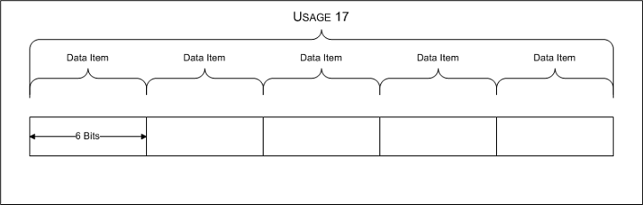

# Value Capability Arrays

A *value capability array* contains information about the value usages supported by a [top-level collection](top-level-collections.md) for a specific type of HID report. Information about a collection's value capability arrays is contained in its [**HIDP\_CAPS**](https://msdn.microsoft.com/library/windows/hardware/ff539697) structure.

A user-mode application or kernel-mode driver uses one of the following [HIDClass support routines](https://msdn.microsoft.com/library/windows/hardware/ff538865) to obtain button capability information:

-   [**HidP\_GetValueCaps**](https://msdn.microsoft.com/library/windows/hardware/ff539754) returns a value capability array describing all the values that are contained in a caller-specified report type.

-   [**HidP\_GetSpecificValueCaps**](https://msdn.microsoft.com/library/windows/hardware/ff539737) filters the value capability information it returns by a caller-specified usage page, usage, link collection, and report type.

A value capability array contains [**HIDP\_VALUE\_CAPS**](https://msdn.microsoft.com/library/windows/hardware/ff539832) structures, each one of which describes the following information about a [HID usage](hid-usages.md) or [usage range](hid-usages.md#usage-range):

-   The [usage page](hid-usages.md#usage-page) for a usage or usage range

-   The report ID of the report that contains the value

-   A [usage ID](hid-usages.md#usage-id) or a usage range

-   Indicates whether a usage is an [aliased usage](hid-usages.md#aliased-usages)

-   Information about the [link collection](link-collections.md) that contains the usage or usage range

-   The size, in bits, of a value, and the report count (which is the number of individual values described by the structure)

-   Attributes of each value, including: whether it has a null value, its units and exponent, and its logical and physical ranges

-   Information about string descriptors and designators associated with the usage or usage range

-   Information about the [data indices](data-indices.md) that the HID parser assigns a usage or usage range

In general, the following conditions hold for all the usages described by a value capability array:

-   Each capability structure represents a usage, a usage range, or a [usage value array](#usage-value-array) that is associated with a variable main item. Array main items are not supported for values.

-   Aliased usages can be used. A usage range cannot be aliased. Aliased values are linked together in a value capability array in the same way as aliased buttons as linked together in a button capability array. See [Button Usages in a Variable Main Item](button-capability-arrays.md#button-usages-in-a-variable-main-item).

-   The HID parser uses only the minimum required usages to assign a usage to each value. The parser assigns usages in the order in which they are specified in a report descriptor. Usages in a report descriptor that are not required, are discarded. The value capability array does not contain any information about discarded usages.

-   The HID parser assigns a unique [data index](data-indices.md) to each usage described in the capability array.

For a description of how data indices are assigned to values, see [Data Indices](data-indices.md).

###  Usage Value Array

A *usage value array* is a consecutive set of values specified in a main item, all of which are assigned the same usage. This occurs if only one usage is specified for a main item whose report count is greater than one.

The following figure shows an example of a usage value array that contains five data items, each six bits long.

In the previous example, the value capability structure for such a usage value array would have its **IsRange** member set to **FALSE**, its **NotRange.Usage** member set to 17, its **ReportCount** member set to 5, and its **BitSize** member set to 6.

If the report count for a usage is 1, use **HidP\_GetUsageValue** to extract the usage value. If the usage's report count is greater than 1, **HidP\_GetUsageValue** only returns the first data item in a usage value array. To extract all the data items in a usage value array, use [**HidP\_GetUsageValueArray**](https://msdn.microsoft.com/library/windows/hardware/ff539750).

 

 

