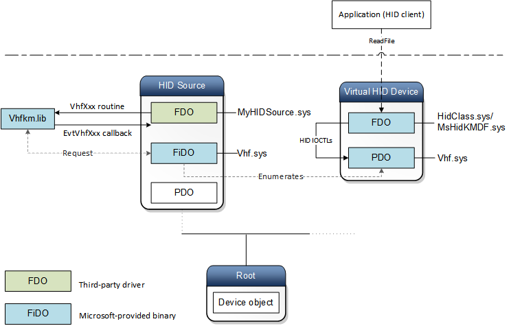

# Write a HID source driver by using Virtual HID Framework (VHF)

**Summary**

-   Write a Kernel-Mode Driver Framework (KMDF)HID source driver that submits HID Read Reports to the operating system.
-   Load the VHF driver as the lower filter to the HID source driver in the virtual HID device stack.

**Applies to**

-   Windows 10
-   Driver developers for HID devices

**Important APIs**

-   [Virtual HID Framework Callback Functions](/windows-hardware/drivers/ddi/_hid/#callback-functions)
-   [Virtual HID Framework Methods](/windows-hardware/drivers/ddi/_hid/#functions)
-   [Virtual HID Framework Structures](/windows-hardware/drivers/ddi/_hid/#functions)

Learn about writing a HID source driver that reports HID data to the operating system.

A HID input device, such as – a keyboard, mouse, pen, touch, or button, sends various reports to the operating system so that it can understand the purpose of the device and take necessary action. The reports are in the form of [HID collections](opening-hid-collections.md) and [HID Usages](hid-usages.md). The device sends those reports over various transports, some of which are supported by Windows, such as [HID over I2C](hid-over-i2c-guide.md) and [HID over USB](hid-over-usb.md). In some cases, the transport might not be supported by Windows, or the reports might not directly map to real hardware. It can be a stream of data in the HID format that is sent by another software component for virtual hardware such as, for non-GPIO buttons or sensors. For example, consider accelerometer data from a phone that is behaving as a game controller, sent wirelessly to a PC. In another example, a computer can receive remote input from a Miracast device by using the UIBC protocol.

In previous versions of Windows, to support new transports (real hardware or software), you had to write a [HID transport minidriver](transport-minidrivers.md) and bind it to the Microsoft-provided in-box class driver, Hidclass.sys. The class/mini driver pair provided the HID collections, such as [Top-Level Collections](top-level-collections.md) to upper-level drivers and user-mode applications. In that model, the challenge was writing the minidriver, which can be a complex task.

Starting in Windows 10, the new Virtual HID Framework (VHF) eliminates the need to write a transport minidriver. Instead you can write a HID source driver by using KMDF or WDM programming interfaces. The framework consists of a Microsoft-provided static library that exposes programming elements used by your driver. It also includes a Microsoft-provided in-box driver that enumerates one or more child devices and proceeds to build and manage a virtual HID tree.

**Note**  In this release, VHF supports a HID source driver only in kernel mode.

This topic describes the architecture of the framework, the virtual HID device tree, and the configuration scenarios.

## Virtual HID device tree

In this image, the device tree shows the drivers and their associated device objects.



**HID source driver (your driver)**

The HID source driver links to Vhfkm.lib and includes Vhf.h in its build project. The driver can be written by using either [Windows Driver Model](../kernel/writing-wdm-drivers.md) (WDM) or Kernel-Mode Driver Framework (KMDF) that is part of the [Windows Driver Frameworks (WDF)](../what-s-new-in-driver-development.md). The driver can be loaded as a filter driver or a function driver in the device stack.

**VHF static library (vhfkm.lib)**

The static library is included in the Windows Driver Kit (WDK) for Windows 10. The library exposes programming interfaces such as routines and callback functions that are used by your HID source driver. When your driver calls a function, the static library forwards the request to the VHF driver that handles the request.

**VHF driver (Vhf.sys)**

A Microsoft-provided in-box driver. This driver must be loaded as a lower filter driver below your driver in the HID source device stack. The VHF driver dynamically enumerates child devices and creates physical device objects (PDO) for one or more HID devices that are specified by your HID source driver. It also implements the HID Transport mini-driver functionality of the enumerated child devices.

**HID class driver pair (Hidclass.sys, Mshidkmdf.sys)**

The Hidclass/Mshidkmdf pair enumerates [Top-Level Collections (TLC)](top-level-collections.md) similar to how it enumerates those collections for a real HID device. A HID client can continue to request and consume the TLCs just like a real HID device. This driver pair is installed as the function driver in the device stack.

**Note**  In some scenarios, a HID client might need to identify the source of HID data. For example, a system has a built-in sensor and receives data from a remote sensor of the same type. The system might want to choose one sensor to be more reliable. To differentiate between the two sensors connected to the system, the HID client queries for the container ID of the TLC. In this case, a HID source driver can provide the container ID, which is reported as the container ID of the virtual HID device by VHF.

**HID client (application)**

Queries and consumes the TLCs that are reported by the HID device stack.

## Header and library requirements

This procedure describes how to write a simple HID source driver that reports headset buttons to the operating system. In this case, the driver that implements this code can be an existing KMDF audio driver that has been modified to act as a HID source reporting headset buttons by using VHF.

1.  Include Vhf.h, included in the WDK for Windows 10.
2.  Link to vhfkm.lib, included in the WDK.
3.  Create a HID Report Descriptor that your device wants to report to the operating system. In this example, the HID Report Descriptor describes the headset buttons. The report specifies a HID Input Report, size 8 bits (1 byte). The first three bits are for the headset middle, volume-up, and volume-down buttons. The remaining bits are unused.

```cpp
UCHAR HeadSetReportDescriptor[] = {
    0x05, 0x01,         // USAGE_PAGE (Generic Desktop Controls)
    0x09, 0x0D,         // USAGE (Portable Device Buttons)
    0xA1, 0x01,         // COLLECTION (Application)
    0x85, 0x01,         //   REPORT_ID (1)
    0x05, 0x09,         //   USAGE_PAGE (Button Page)
    0x09, 0x01,         //   USAGE (Button 1 - HeadSet : middle button)
    0x09, 0x02,         //   USAGE (Button 2 - HeadSet : volume up button)
    0x09, 0x03,         //   USAGE (Button 3 - HeadSet : volume down button)
    0x15, 0x00,         //   LOGICAL_MINIMUM (0)
    0x25, 0x01,         //   LOGICAL_MAXIMUM (1)
    0x75, 0x01,         //   REPORT_SIZE (1)
    0x95, 0x03,         //   REPORT_COUNT (3)
    0x81, 0x02,         //   INPUT (Data,Var,Abs)
    0x95, 0x05,         //   REPORT_COUNT (5)
    0x81, 0x03,         //   INPUT (Cnst,Var,Abs)
    0xC0,               // END_COLLECTION
};
```

## Create a virtual HID device

Initialize a [**VHF\_CONFIG**](/windows-hardware/drivers/ddi/vhf/ns-vhf-_vhf_config) structure by calling the [**VHF\_CONFIG\_INIT**](/windows-hardware/drivers/ddi/vhf/nf-vhf-vhf_config_init) macro and then call the [**VhfCreate**](/windows-hardware/drivers/ddi/vhf/nf-vhf-vhfcreate) method. The driver must call **VhfCreate** at PASSIVE\_LEVEL after the [**WdfDeviceCreate**](/windows-hardware/drivers/ddi/wdfdevice/nf-wdfdevice-wdfdevicecreate) call, typically, in the driver's [*EvtDriverDeviceAdd*](/windows-hardware/drivers/ddi/wdfdriver/nc-wdfdriver-evt_wdf_driver_device_add) callback function.

In the [**VhfCreate**](/windows-hardware/drivers/ddi/vhf/nf-vhf-vhfcreate) call, the driver can specify certain configuration options, such as operations that must be processed asynchronously or setting device information (vendor/product IDs).

For example, an application requests a TLC. When the HID class driver pair receives that request, the pair determines the type of request and creates an appropriate [HID Minidriver IOCTL](/windows-hardware/drivers/ddi/_hid/#hid-minidriver-ioctls) request and forwards it to VHF. Upon getting the IOCTL request, VHF can handle the request, rely on the HID source driver to process it, or complete the request with STATUS\_NOT\_SUPPORTED.

VHF handles these IOCTLs:

-   [**IOCTL\_HID\_GET\_STRING**](/windows-hardware/drivers/ddi/hidport/ni-hidport-ioctl_hid_get_string)
-   [**IOCTL\_HID\_GET\_DEVICE\_ATTRIBUTES**](/windows-hardware/drivers/ddi/hidport/ni-hidport-ioctl_hid_get_device_attributes)
-   [**IOCTL\_HID\_GET\_DEVICE\_DESCRIPTOR**](/windows-hardware/drivers/ddi/hidport/ni-hidport-ioctl_hid_get_device_descriptor)
-   [**IOCTL\_HID\_GET\_REPORT\_DESCRIPTOR**](/windows-hardware/drivers/ddi/hidport/ni-hidport-ioctl_hid_get_report_descriptor)

If the request is **GetFeature**, **SetFeature**, **WriteReport**, or **GetInputReport**, and the HID source driver registered a corresponding callback function, VHF invokes the callback function. Within that function, the HID source driver can get or set HID data for the HID virtual device. If the driver doesn't register a callback, VHF completes the request with status STATUS\_NOT\_SUPPORTED.

VHF invokes HID source driver-implemented event callback functions for these IOCTLs:

-   [**IOCTL\_HID\_READ\_REPORT**](/windows-hardware/drivers/ddi/hidport/ni-hidport-ioctl_hid_read_report)

    If the driver wants to handle the buffering policy while submitting a buffer to obtain HID Input Report, it must implement the [*EvtVhfReadyForNextReadReport*](/windows-hardware/drivers/ddi/vhf/nc-vhf-evt_vhf_ready_for_next_read_report) and specify a pointer in the **EvtVhfAsyncOperationGetInputReport** member. For more information, see [Submit the HID Input Report](#submit-the-hid-input-report).

-   [**IOCTL\_HID\_GET\_FEATURE**](/windows-hardware/drivers/ddi/hidclass/ni-hidclass-ioctl_hid_get_feature) or [**IOCTL\_HID\_SET\_FEATURE**](/windows-hardware/drivers/ddi/hidclass/ni-hidclass-ioctl_hid_set_feature)

    If the driver wants to get or set a HID Feature Report asynchronously, the driver must implement the [*EvtVhfAsyncOperation*](/windows-hardware/drivers/ddi/vhf/nc-vhf-evt_vhf_async_operation) function and specify a pointer to the get or set implementation function in the **EvtVhfAsyncOperationGetFeature** or **EvtVhfAsyncOperationSetFeature** member of [**VHF\_CONFIG**](/windows-hardware/drivers/ddi/vhf/ns-vhf-_vhf_config).

-   [**IOCTL\_HID\_GET\_INPUT\_REPORT**](/windows-hardware/drivers/ddi/hidclass/ni-hidclass-ioctl_hid_get_input_report)

    If the driver wants to get a HID Input Report asynchronously, the driver must implement the [*EvtVhfAsyncOperation*](/windows-hardware/drivers/ddi/vhf/nc-vhf-evt_vhf_async_operation) function and specify a pointer to the function in the **EvtVhfAsyncOperationGetInputReport** member of [**VHF\_CONFIG**](/windows-hardware/drivers/ddi/vhf/ns-vhf-_vhf_config).

-   [**IOCTL\_HID\_WRITE\_REPORT**](/windows-hardware/drivers/ddi/hidport/ni-hidport-ioctl_hid_write_report)

    If the driver wants to get a write a HID Input Report asynchronously, the driver must implement the [*EvtVhfAsyncOperation*](/windows-hardware/drivers/ddi/vhf/nc-vhf-evt_vhf_async_operation) function and specify a pointer to the function in the **EvtVhfAsyncOperationWriteReport** member of [**VHF\_CONFIG**](/windows-hardware/drivers/ddi/vhf/ns-vhf-_vhf_config).

For any other [HID Minidriver IOCTL](/windows-hardware/drivers/ddi/index), VHF completes the request with STATUS\_NOT\_SUPPORTED.

The virtual HID device is deleted by calling the [**VhfDelete**](/windows-hardware/drivers/ddi/vhf/nf-vhf-vhfdelete). The [*EvtVhfCleanup*](/windows-hardware/drivers/ddi/vhf/nc-vhf-evt_vhf_cleanup) callback is required if the driver allocated resources for the virtual HID device. The driver must implement the *EvtVhfCleanup* function and specify a pointer to that function in the **EvtVhfCleanup** member of [**VHF\_CONFIG**](/windows-hardware/drivers/ddi/vhf/ns-vhf-_vhf_config). *EvtVhfCleanup* is invoked before the **VhfDelete** call completes. For more information, see [Delete the virtual HID device](#delete-the-virtual-hid-device).

**Note**  After an asynchronous operation completes, the driver must call [**VhfAsyncOperationComplete**](/windows-hardware/drivers/ddi/vhf/nf-vhf-vhfasyncoperationcomplete) to set the results of the operation. You can call the method from the event callback or at a later time after returning from the callback.

```cpp
NTSTATUS
VhfSourceCreateDevice(
_Inout_ PWDFDEVICE_INIT DeviceInit
)

{
    WDF_OBJECT_ATTRIBUTES   deviceAttributes;
    PDEVICE_CONTEXT deviceContext;
    VHF_CONFIG vhfConfig;
    WDFDEVICE device;
    NTSTATUS status;

    PAGED_CODE();

    WDF_OBJECT_ATTRIBUTES_INIT_CONTEXT_TYPE(&deviceAttributes, DEVICE_CONTEXT);
    deviceAttributes.EvtCleanupCallback = VhfSourceDeviceCleanup;

    status = WdfDeviceCreate(&DeviceInit, &deviceAttributes, &device);

    if (NT_SUCCESS(status))
    {
        deviceContext = DeviceGetContext(device);

        VHF_CONFIG_INIT(&vhfConfig,
            WdfDeviceWdmGetDeviceObject(device),
            sizeof(VhfHeadSetReportDescriptor),
            VhfHeadSetReportDescriptor);

        status = VhfCreate(&vhfConfig, &deviceContext->VhfHandle);

        if (!NT_SUCCESS(status)) {
            TraceEvents(TRACE_LEVEL_ERROR, TRACE_DEVICE, "VhfCreate failed %!STATUS!", status);
            goto Error;
        }

        status = VhfStart(deviceContext->VhfHandle);
        if (!NT_SUCCESS(status)) {
            TraceEvents(TRACE_LEVEL_ERROR, TRACE_DEVICE, "VhfStart failed %!STATUS!", status);
            goto Error;
        }

    }

Error:
    return status;
}
```

## Submit the HID input report

Submit the HID input report by calling [**VhfReadReportSubmit**](/windows-hardware/drivers/ddi/vhf/nf-vhf-vhfreadreportsubmit).

Typically, a HID device sends information about state changes by sending input reports through interrupts. For example, the headset device might send a report when the state of a button changes. In such an event, the driver's interrupt service routine (ISR) is invoked. In that routine, the driver might schedule a deferred procedure call (DPC) that processes the input report and submits it to VHF, which sends the information to the operating system. By default, VHF buffers the report and the HID source driver can start submitting HID Input Reports as they come in. This and eliminates the need for the HID source driver to implement complex synchronization.

The HID source driver can submit input reports by implementing the buffering policy for pending reports. To avoid duplicate buffering, the HID source driver can implement the [*EvtVhfReadyForNextReadReport*](/windows-hardware/drivers/ddi/vhf/nc-vhf-evt_vhf_ready_for_next_read_report) callback function and keep track of whether VHF invoked this callback. If it was previously invoked, the HID source driver can call [**VhfReadReportSubmit**](/windows-hardware/drivers/ddi/vhf/nf-vhf-vhfreadreportsubmit) to submit a report. It must wait for *EvtVhfReadyForNextReadReport* to get invoked before it can call **VhfReadReportSubmit** again.

```cpp
VOID
MY_SubmitReadReport(
    PMY_CONTEXT  Context,
    BUTTON_TYPE  ButtonType,
    BUTTON_STATE ButtonState
    )
{
    PDEVICE_CONTEXT deviceContext = (PDEVICE_CONTEXT)(Context);

    if (ButtonState == ButtonStateUp) {
        deviceContext->VhfHidReport.ReportBuffer[0] &= ~(0x01 << ButtonType);
    } else {
        deviceContext->VhfHidReport.ReportBuffer[0] |=  (0x01 << ButtonType);
    }

    status = VhfReadReportSubmit(deviceContext->VhfHandle, &deviceContext->VhfHidReport);

    if (!NT_SUCCESS(status)) {
        TraceEvents(TRACE_LEVEL_ERROR, TRACE_DEVICE,"VhfReadReportSubmit failed %!STATUS!", status);
    }
}
```

## Delete the virtual HID device

Delete the virtual HID device by calling [**VhfDelete**](/windows-hardware/drivers/ddi/vhf/nf-vhf-vhfdelete).

[**VhfDelete**](/windows-hardware/drivers/ddi/vhf/nf-vhf-vhfdelete) can be called synchronous or asynchronously by specifying the Wait parameter. For a synchronous call, the method must be called at PASSIVE\_LEVEL, such as from [*EvtCleanupCallback*](/windows-hardware/drivers/ddi/wdfobject/nc-wdfobject-evt_wdf_object_context_cleanup) of the device object. **VhfDelete** returns after deleting the virtual HID device. If the driver calls **VhfDelete** asynchronously, it returns immediately and VHF invokes [*EvtVhfCleanup*](/windows-hardware/drivers/ddi/vhf/nc-vhf-evt_vhf_cleanup) after the delete operation is complete. The method can be called at maximum DISPATCH\_LEVEL. In this case, the driver must have registered and implemented an *EvtVhfCleanup* callback function when it previously called [**VhfCreate**](/windows-hardware/drivers/ddi/vhf/nf-vhf-vhfcreate). Here is the sequence of events when HID source driver wants to delete the virtual HID device:

1.  HID source driver stops initiating calls into VHF.
2.  HID source calls [**VhfDelete**](/windows-hardware/drivers/ddi/vhf/nf-vhf-vhfdelete) with *Wait* set to FALSE.
3.  VHF stops invoking callback functions implemented by the HID source driver.
4.  VHF starts reporting the device as missing to PnP Manager. At this point, the VhfDelete call might return.
5.  When the device is reported as a missing device, VHF invokes [*EvtVhfCleanup*](/windows-hardware/drivers/ddi/vhf/nc-vhf-evt_vhf_cleanup) if the HID source driver registered its implementation.
6.  After [*EvtVhfCleanup*](/windows-hardware/drivers/ddi/vhf/nc-vhf-evt_vhf_cleanup) returns, VHF performs its cleanup.

```cpp
VOID
VhfSourceDeviceCleanup(
_In_ WDFOBJECT DeviceObject
)
{
    PDEVICE_CONTEXT deviceContext;

    PAGED_CODE();

    TraceEvents(TRACE_LEVEL_INFORMATION, TRACE_DEVICE, "%!FUNC! Entry");

    deviceContext = DeviceGetContext(DeviceObject);

    if (deviceContext->VhfHandle != WDF_NO_HANDLE)
    {
        VhfDelete(deviceContext->VhfHandle, TRUE);
    }

}
```

## Install the HID source driver

In the INF file that installs the HID source driver, make sure that you declare Vhf.sys as a lower filter driver to your HID source driver by using the [**AddReg Directive**](../install/inf-addreg-directive.md).

```cpp
[HIDVHF_Inst.NT.HW]
AddReg = HIDVHF_Inst.NT.AddReg

[HIDVHF_Inst.NT.AddReg]
HKR,,"LowerFilters",0x00010000,"vhf"
```

## Related topics
[Human Interface Device](https://developer.microsoft.com/windows/hardware)
