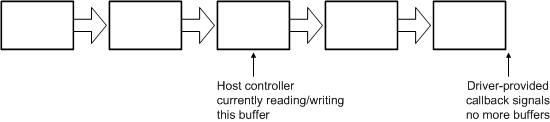

# Buffering Isochronous DMA Transfers for IEEE 1394 Devices

## 

Once begun, isochronous transfer is continuous until halted. The host controller must have a ready supply of buffers to handle the transaction's demands. The bus driver uses the buffers attached to the resource handle until they are used up, and then halts the DMA. Before this happens, the driver attaches additional buffers to continue the transaction. The ISOCH\_DESCRIPTOR for a buffer optionally provides a callback for when the bus driver has finished with a buffer—the driver can use this to attach additional buffers. For optimal performance, the driver should attach several buffers at a time, and provide a callback only with the last buffer to signal that the supply of buffers has run out.

The following diagram illustrates buffers used in isochronous transfer.

 

 

--------------------

