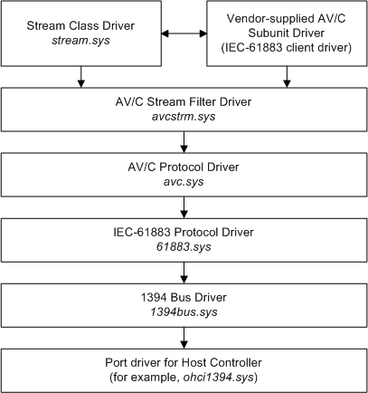

# IEC-61883 Protocol Driver in a Client Driver Stack

IEC-61883 client drivers rely on *61883.sys* to communicate with their devices using the IEC-61883 protocol.

The following diagram shows an example of the *61883.sys* in an AV/C driver stack. The vendor-supplied AV/C subunit driver is the IEC-61883 client in this example.

Starting from the top of the diagram:

-   The stream class driver, *stream.sys*, supports kernel streaming drivers for devices such as DVD, video capture, and external sound devices. The stream class driver is documented in the [Streaming Minidrivers](https://msdn.microsoft.com/library/windows/hardware/ff568277).

-   In this example, the IEC-61883 client is a vendor-supplied AV/C subunit driver. This is a [Writing a Stream Minidriver](https://msdn.microsoft.com/library/windows/hardware/ff568794) that uses facilities provided by lower drivers in the AV/C stack to control its device. (For more information about AV/C subunit drivers, see [AV/C Client Drivers](https://msdn.microsoft.com/library/windows/hardware/ff556367).)

    AV/C subunit drivers set up plug connections and streams, and expose subunit control, status, and notification. They use the kernel streaming framework to expose a generic pin property set and device-specific property and event sets.

-   The AV/C stream filter driver, *avcstrm.sys*, is an optional WDM filter driver that isolates stream-specific format handling for subunit drivers. The AV/C stream filter driver is specified as a lower driver by third-party INF files. It supports DV and MPEG stream format for subunit drivers and supplies CMP helper functions in conjunction with *avc.sys*. It also provides kernel-streaming data structures and data intersection handlers.

-   The AV/C protocol driver, *avc.sys*, maps AV/C commands to WDM IRPs, retries requests (for example, if a subunit is busy), handles interim responses as pending IRPs, and routes responses to the correct subunit driver based on type, ID, and operation code. For Microsoft Windows XP and later, *avc.sys* also provides plug connection management. (For more information about support that Microsoft provides for the AV/C protocol, see [AV/C Client Drivers](https://msdn.microsoft.com/library/windows/hardware/ff556367).)

-   The IEC-61883 protocol driver, *61883.sys*, handles function control protocol (FCP), common isochronous packet (CIP) format, and connection management procedures (CMP) requests sent down the AV/C driver stack.

-   The 1394 bus driver, *1394bus.sys*, enumerates devices on the IEEE 1394 bus and responds to Plug and Play and power management IRPs on their behalf.

-   The port driver for the host controller provides a hardware-independent interface to the IEEE 1394 bus. The port driver handles some IRPs and forwards others to the port driver for the motherboard's host controller. Microsoft supplies a standard port driver, *ohci1394.sys*, for host controllers that satisfy the *1394 Open Host Controller Interface Specification*, which is available for download from the [IEEE 1394 technology](http://go.microsoft.com/fwlink/p/?linkid=8729) website.

AV/C subunit drivers are just one of the possible types of IEC-61883 client drivers. Another example would be a driver that utilizes the HAVi protocol layered above IEC-61883. Although *61883.sys* and the IEC-61883 protocol do not have any AV/C or HAVi dependencies, clients of *61883.sys* can operate under different constraints. For example, AV/C subunit drivers are usually clients of *avc.sys*, which provides FCP-related functions and blocks upper-level drivers from sending FCP-related requests down the stack to be handled by *61883.sys*.

 

 

