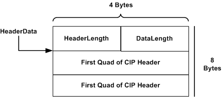

# Isochronous Talk Options for IEEE 1394 Devices


There are three ways of organizing output data in isochronous talk operations: packets with no headers, fixed-sized data packets with headers, and variable-size data packets with headers.

### Packets with no Headers

By default, the host controller sends out the data in the attached buffers, indicated by the **Mdl** member of the [**ISOCH\_DESCRIPTOR**](https://msdn.microsoft.com/library/windows/hardware/ff537401) structure, in the order the buffers were attached. In the default case, the host controller automatically splits the buffer into packets of size no greater than that specified in the **nMaxBytesPerFrame** member of the buffer's ISOCH\_DESCRIPTOR structure.

For example, the driver for a device that expects to receive its data in 512 byte packets would include the following in its declaration of the buffer's ISOCH\_DESCRIPTOR:

```cpp
/* elsewhere, the buffer has declared: */
/*        ISOCH_DESCRIPTOR isoch_descriptor; */
isoch_descriptor->nMaxBytesPerFrame = 512;
```

### Fixed-size Data Packets with Headers

Some devices require that some header information be prepended to each packet the device receives. (This header information would be inserted before the data, but after the IEEE 1394 standard isochronous packet header.) In this instance, drivers can assemble a buffer of headers, and a buffer of data, and have the host controller automatically prepend a header to the data packets it sends to the device. The driver indicates that a buffer contains a list of headers by specifying the DESCRIPTOR\_HEADER\_SCATTER\_GATHER flag in that buffer's ISOCH\_DESCRIPTOR structure. There are two types of headers that can be prepended to a data packet: fixed-sized and variable-sized.

With fixed-size headers, the driver specifies the header size in the **nMaxBytesPerFrame** member of the ISOCH\_DESCRIPTOR structure. The host controller treats this buffer and the next buffer as a pair: a header buffer and data buffer. When it assembles the data packets, it takes one frame from the header buffer and one frame from the data buffer, and splices them together to form the next packet it sends to the device.

For example, suppose the device expects each 512 byte data buffer to be preceded by an 8 byte header. The driver could declare a pair of ISOCH\_DESCRIPTOR structures as follows:

```cpp
/* elsewhere, the buffer has declared: */
/*        ISOCH_DESCRIPTOR isoch_descriptor_1, isoch_descriptor_2; */
/*        #define NUM_HEADERS to be the number of headers included in  */
/*        the first buffer */
 
isoch_descriptor_1->fulFlags = DESCRIPTOR_HEADER_SCATTER_GATHER;
isoch_descriptor_1->ulLength = 8 * NUM_HEADERS;
isoch_descriptor_1->nMaxBytesPerFrame = 8;
       .
       .
       .
isoch_descriptor_2->ulLength = 512 * NUM_HEADERS;
isoch_descriptor_2->nMaxBytesPerFrame = 512;
```

Not all host controllers support the DESCRIPTOR\_HEADER\_SCATTER\_GATHER flag. To determine if the host controller supports it, query the bus driver with the [**REQUEST\_GET\_LOCAL\_HOST\_INFO**](https://msdn.microsoft.com/library/windows/hardware/ff537644) request, with **nLevel** = GET\_HOST\_CAPABILITIES. The bus driver will set the HOST\_INFO\_SUPPORTS\_ISO\_HDR\_INSERTION flag of the **HostCapabilities** member of the GET\_LOCAL\_HOST\_INFO2 structure it returns.

### Variable-size Data Packets with Headers

This case is similar to the fixed-size packet case. As with the fixed-size case, the driver must set the DESCRIPTOR\_HEADER\_SCATTER\_GATHER flag in the header buffer's ISOCH\_DESCRIPTOR structure as follows:

```cpp
isoch_descriptor_1->fulFlags = DESCRIPTOR_HEADER_SCATTER_GATHER;
```

But for the variable-size case, the driver must also set the RESOURCE\_VARIABLE\_ISOCH\_PAYLOAD flag in the **u.IsochAllocateResources.fulFlags** member of the IRB when it allocates resources with a [**REQUEST\_ISOCH\_ALLOCATE\_RESOURCES**](https://msdn.microsoft.com/library/windows/hardware/ff537649) request.

Also, in the case of variable-size data packets, the driver must assemble a buffer of headers as in the fixed-size case. However, with variable-size packets, unlike fixed-size packets, the driver must record the size of each packet in a scatter/gather *header element* that it prepends to each header.

Header elements are defined by the following structure found in *1394.h*:

```cpp
typedef struct _IEEE1394_SCATTER_GATHER_HEADER {
  USHORT  HeaderLength;
  USHORT  DataLength;
  UCHAR  HeaderData;
} IEEE1394_SCATTER_GATHER_HEADER, *PIEEE1394_SCATTER_GATHER_HEADER;
```

The header element indicates both the length of the header and the length of the data. Thus, with variable-size data packets, the **nMaxSizeBytesPerFrame** member of the *data* descriptor no longer indicates the size of an individual data packet. Each data packet can have a different size that is indicated in its corresponding header element. The **nMaxSizeBytesPerFrame** member of the *header* descriptor is defined as follows.

```cpp
IsochDescriptor->nMaxBytesPerFrame = MAX_HEADER_DATA_SIZE+FIELD_OFFSET(HeaderElement,HeaderData)
```

where MAX\_HEADER\_DATA\_SIZE indicates the size of the header to be prepended to each data packet, and FIELD\_OFFSET(HeaderElement,HeaderData) indicates the length of the header element inserted immediately before each header.

You should be aware of a subtlety with regard to the definition of **nMaxBytesPerFrame** whenever your driver is transmitting variable-size packets in "talk mode". There are two cases in which a driver must define **nMaxBytesPerFrame**, and in both cases the host controller driver interprets the value assigned to **nMaxBytesPerFrame** as a *minimum* frame size, rather than a maximum, if the driver is transmitting frames that are of variable size.

-   During a REQUEST\_ISOCH\_ALLOCATE\_RESOURCES request, the driver must indicate the frame size in the **u.IsochAllocateResources.nMaxBytesPerFrame** member of [**IRB**](https://msdn.microsoft.com/library/windows/hardware/ff537350).

-   During a REQUEST\_ISOCH\_ATTACH\_BUFFERS request, the driver must indicate the frame size in the **nMaxBytesPerFrame** member of [**ISOCH\_DESCRIPTOR**](https://msdn.microsoft.com/library/windows/hardware/ff537401).

The smaller the frame, the more frames the host controller driver can fit into the transmission buffer. Because each frame requires system resources such as time stamps and status information, smaller frames consume system resources more rapidly. The host controller driver calculates the number of frames that will fit in the buffer and the number of resources required for those frames, based on the value in **nMaxBytesPerFrame**. If there are frames smaller than the size indicated in **nMaxBytesPerFrame**, the number of frames requiring resources will be larger than the value calculated by the host controller driver, and this might lead to an error.

These considerations do not apply when the driver is receiving data, only when the driver is transmitting variable-size frames in "talk mode". Drivers specify the type of data transmission associated with a particular channel when obtaining a resource handle for the channel with a [**REQUEST\_ISOCH\_ALLOCATE\_RESOURCES**](https://msdn.microsoft.com/library/windows/hardware/ff537649) request. The driver sets the RESOURCE\_VARIABLE\_ISOCH\_PAYLOAD flag in **u.IsochAllocateResources.fulFlags** during this request to indicate that it will transmit variable-size frames. The driver sets the RESOURCE\_USED\_IN\_TALKING flag in **u.IsochAllocateResources.fulFlags** to indicate that it will use the channel to transmit rather than receive data. Only when the driver sets both of these flags during the resource allocation request will the host controller driver interpret **nMaxBytesPerFrame** as a minimum rather than a maximum value.

Note that the **u.IsochAllocateResources.nMaxBufferSize** member of [**IRB**](https://msdn.microsoft.com/library/windows/hardware/ff537350) is always a maximum.

Drivers can now transmit header-only data packets by simply setting the **DataLength** member of a header element to zero:

```cpp
HeaderElement->DataLength = 0
```

The total length of the header descriptor buffer is indicated in the usual way by means of the **ulLength** member of the descriptor. It must be an integer multiple of the number of header scatter/gather elements:

```cpp
IsochDescriptor->ulLength = IsochDescriptor->nMaxBytesPerFrame * NUMBER_OF_PACKETS;
```

where NUMBER\_OF\_PACKETS is the number of packets to be transmitted (including header-only packets).

The third member of the header element structure, **HeaderData**, is merely a place holder that indicates where the header data begins. The following diagram illustrates an example of an assembled buffer of 8-byte CIP headers.



All headers in a given descriptor must be of the same length. This allows the OHCI port driver (*ohci1394.sys*) to parse the header descriptor like an array of fixed-size elements. Data packets can vary in size, but must be contiguous, with no "holes."

Data in both header and data descriptors must be page-aligned. There is no restriction on the size of data packets, but neither header nor data packets are allowed to straddle page boundaries. Drivers must align descriptor buffers properly *before setting up the MDL for the buffer*.

If, for example, the driver assembles a header descriptor with 12-byte headers and 4-byte header elements, each data packet will have 16 bytes of prepended data. Because 16-bytes fits into a 4,096-byte page exactly 256 times, none of the prepended data ever straddles a page boundary.

If, on the other hand, the driver assembles a header descriptor with 8-byte headers and 4-byte header elements, then each data packet will have 12 bytes of prepended data. Because a 4,096 byte page is not an integer multiple of 12, the header descriptor must be under 4,096 bytes in size to prevent a header from straddling a page boundary. However, the size of the header descriptor buffer can be extended up to two pages by adjusting the base address of the buffer as illustrated in the pseudocode that follows.

```cpp
// First find the number of headers (together with header elements)
// that will fit in a page. Use a floor function that rounds down to 
// the nearest integer
PrependData = sizeof(header) + 8; // First two fields of header element take up 8 bytes
NumHeaders =floor(PAGE_SIZE/PrependData);
// By forcing the buffer address defined in the MDL to begin at the appropriate offset,
// the driver can guarantee that the last header in the buffer will be aligned on a page 
// boundary. That way, DMA can continue across at least one page boundary.
r = PAGE_SIZE - (NumHeaders*12).
// BufferAddress = the page-aligned address returned by a memory allocation routine
// Adjust buffer starting address
BufferAddress += r;
isochDescriptor->mdl = IoAllocateMdl(BufferAddress, ... and so on.)
```

 

 


