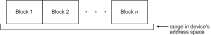
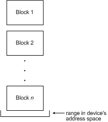

# Sending Asynchronous I/O Request Packets on the IEEE 1394 Bus

## 

Drivers use REQUEST\_ASYNC\_READ, REQUEST\_ASYNC\_WRITE, and REQUEST\_ASYNC\_LOCK to send asynchronous read, write, and lock operations to a device on the IEEE 1394 bus. For REQUEST\_ASYNC\_READ and REQUEST\_ASYNC\_WRITE, the operation-specific parameters of the IRB are stored in either **u.AsyncRead** or **u.AsyncWrite** members of the IRB.

### Types of Addressing

Drivers that make asynchronous I/O requests must specify a destination address of type [**IO\_ADDRESS**](https://msdn.microsoft.com/library/windows/hardware/ff537346) in the **DestinationAddress** member of the IRB. The destination address consists of two values: the node address and the address offset. The interpretation that the bus driver gives to these two values depends on the mode of addressing used by the driver that initiates the request.

Three modes of addressing are available to send asynchronous 1394 packets: *normal*, *raw*, and *virtual*.

In normal-mode addressing the driver that initiates the request provides an address offset, but does not specify the node address of the target device. The bus driver fills in the node address using information that it stored in the device's PDO when it enumerated the device.

In raw-mode addressing, the driver that initiates the request must provide both the node address and the address offset. Additionally, instead of sending the request to the PDO of the target device, the driver must send the request to the PDO of the host controller. This informs the bus driver that it should not overwrite the node address information in the packet.

In virtual-mode addressing, the driver that initiates the request must explicitly indicate the node address of the target device in the packet, just as it would in raw-mode addressing. However, virtual devices do not have real node addresses on the 1394 bus. The node address of a virtual device is just a value established by convention that allows the driver for the virtual device to identify its packets. When operating properly, a virtual device driver should receive all packets that are broadcast on the bus and sift through them searching for packets that contain the preestablished value for its device's "node address."

A driver that initiates a request for a virtual device does not need to take any special steps to prevent the bus driver from overwriting the node address recorded in the packet. When the bus driver first enumerates a virtual device, it sets a flag in the device extension of the device's PDO indicating that the device is virtual. On receiving a request for this device, the bus driver is able to verify that it is a virtual device and does not overwrite the node address in the packet.

### Buffering of I/O requests

A driver that initiates an asynchronous I/O request must provide a pointer to an MDL that specifies the I/O buffer. It puts this pointer in the **Mdl** member of the IRB. The bus driver uses this buffer to copy the data it reads from the device, or as the source of the data it writes to the device.

Drivers specify the size of the data buffer in the **nNumberOfBytesToRead** or **nNumberOfBytesToWrite** members of **u.AsyncXXX**, and the block size in the **nBlockSize** member. When the transaction actually takes place, the bus driver breaks up the data into packets of the size specified in **nBlockSize**. By default, the bus driver reads or writes the data contiguously: each block is read from or written to successive locations in the device's address space.

The following diagram illustrates contiguous data blocks.

Optionally, the driver can specify the ASYNC\_FLAGS\_NONINCREMENTING flag for the request; then the bus driver will use the same set of addresses for each block.

The following diagram illustrates asynchronous non-incrementing data blocks.

**Warning**  The bus driver enforces the maximum asynchronous packet size for the current connection speed between the device and the computer, and the maximum speed the device reports in the MAX\_REC field of its configuration ROM. If **nBlockSize** is greater than either of these values, the bus driver uses the enforced value for the block size. If the driver sets the ASYNC\_FLAGS\_NONINCREMENTING flag, this is unlikely to give the desired behavior. If drivers set this flag, they should check that the block size is smaller than the enforced limitations before submitting the request.

 

### Sending lock requests

The IEEE 1394 bus protocol provides asynchronous lock requests, which allow atomic, test-and-set-type operations. In addition to specifying the destination address (in **u.AsyncLock.DestinationAddress**), the driver specifies the transaction type (in **u.AsyncLock.fulTransactionType**). The data value and argument value of the operation (see the IEEE 1394 specification for details) are passed in **u.AsyncLock.DataValues** and **u.AsyncLock.Arguments**.

### Bus reset generation

A device driver that uses asynchronous I/O keeps track of the bus reset generation. In each asynchronous request, the device driver reports that value in the **u.AsyncXxx.ulGeneration** member of the IRB for the request. The bus driver compares that value to the actual generation count, and if they fail to match, it fails the request with a status value of STATUS\_INVALID\_GENERATION. If a request fails in this manner, the driver should query for the correct generation by using the REQUEST\_GET\_GENERATION\_COUNT bus request. However, the driver should not reissue any request that failed with this status until it retrieves new generation in its Bus Reset Notification callback. This ensures that the device is still present on the bus. Note that client drivers should not depend on IRP\_MN\_BUS\_RESET to be notified of a bus reset. IRP\_MN\_BUS\_RESET is obsolete in Windows XP and later operating systems.

 

 

--------------------
[Send comments about this topic to Microsoft](mailto:wsddocfb@microsoft.com?subject=Documentation%20feedback%20%5BIEEE\buses%5D:%20Sending%20Asynchronous%20I/O%20Request%20Packets%20on%20the%20IEEE%201394%20Bus%20%20RELEASE:%20%287/14/2016%29&body=%0A%0APRIVACY%20STATEMENT%0A%0AWe%20use%20your%20feedback%20to%20improve%20the%20documentation.%20We%20don't%20use%20your%20email%20address%20for%20any%20other%20purpose,%20and%20we'll%20remove%20your%20email%20address%20from%20our%20system%20after%20the%20issue%20that%20you're%20reporting%20is%20fixed.%20While%20we're%20working%20to%20fix%20this%20issue,%20we%20might%20send%20you%20an%20email%20message%20to%20ask%20for%20more%20info.%20Later,%20we%20might%20also%20send%20you%20an%20email%20message%20to%20let%20you%20know%20that%20we've%20addressed%20your%20feedback.%0A%0AFor%20more%20info%20about%20Microsoft's%20privacy%20policy,%20see%20http://privacy.microsoft.com/default.aspx. "Send comments about this topic to Microsoft")

