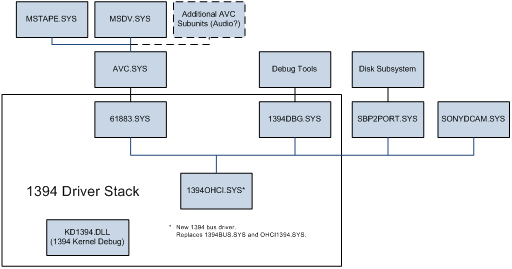
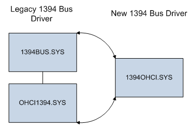

# The IEEE 1394 Driver Stack

## 

The following diagram illustrates the IEEE 1394 driver stack with the new 1394 bus driver and the Microsoft-supported 1394 client drivers.

A client driver for a device that connects to the IEEE 1394 bus driver sits on top of the IEEE 1394 driver stack. The bus driver provides a hardware-independent interface to the IEEE 1394 bus. The device driver communicates with the device by sending IRPs, which are processed by the IEEE 1394 bus driver. Before Windows 7, the bus driver was a combination of a port driver (1394bus.sys) and a primary miniport driver for the motherboard's host controller (ochi1394.sys). In Windows 7 and later versions, the legacy port/miniport bus drivers are replaced by 1394ohci.sys, a monolithic IEEE 1394 bus driver that is implemented by using the kernel-mode driver framework (KMDF). The 1394ohci.sys bus driver is fully backward compatible with the legacy 1394 bus drivers. For more information about some known differences in behavior between the new bus driver and the legacy 1394 bus drivers, see [IEEE 1394 Bus Driver in Windows 7](https://msdn.microsoft.com/library/windows/hardware/gg266402).

The following illustration shows the relationship between the legacy and the new 1394 bus drivers.

To issue commands to devices connected to the bus, drivers issue the [**IRP\_MJ\_DEVICE\_CONTROL**](https://msdn.microsoft.com/library/windows/hardware/ff550744) IRP, with control code [**IOCTL\_1394\_CLASS**](https://msdn.microsoft.com/library/windows/hardware/ff537232). The driver packages the parameters in an IEEE 1394 I/O request block ([**IRB**](https://msdn.microsoft.com/library/windows/hardware/ff537350)), and passes a pointer to it in the **Parameters.Others.Argument1** member of the IRP. The **FunctionNumber** member of the IRB determines the type of operation, and the **u** member describes the operation. The bus driver uses the IOCTL\_1394\_CLASS IRP to present an interface to both the bus and the host controller.

The IRB structure contains parameters that apply to each bus request and request-specific parameters. The **u** member of the IRB contains the request-specific parameters, in a union of data structures, one per request type.

During normal operation, drivers receive ordinary I/O requests (such as [**IRP\_MJ\_READ**](https://msdn.microsoft.com/library/windows/hardware/ff550794)), convert them to the appropriate IEEE 1394 operation, and dispatch that operation to the device through IOCTL\_1394\_CLASS.

## Related topics
[IEEE 1394 Bus Driver in Windows 7](https://msdn.microsoft.com/library/windows/hardware/gg266402)  

--------------------
[Send comments about this topic to Microsoft](mailto:wsddocfb@microsoft.com?subject=Documentation%20feedback%20%5BIEEE\buses%5D:%20The%20IEEE%201394%20Driver%20Stack%20%20RELEASE:%20%287/14/2016%29&body=%0A%0APRIVACY%20STATEMENT%0A%0AWe%20use%20your%20feedback%20to%20improve%20the%20documentation.%20We%20don't%20use%20your%20email%20address%20for%20any%20other%20purpose,%20and%20we'll%20remove%20your%20email%20address%20from%20our%20system%20after%20the%20issue%20that%20you're%20reporting%20is%20fixed.%20While%20we're%20working%20to%20fix%20this%20issue,%20we%20might%20send%20you%20an%20email%20message%20to%20ask%20for%20more%20info.%20Later,%20we%20might%20also%20send%20you%20an%20email%20message%20to%20let%20you%20know%20that%20we've%20addressed%20your%20feedback.%0A%0AFor%20more%20info%20about%20Microsoft's%20privacy%20policy,%20see%20http://privacy.microsoft.com/default.aspx. "Send comments about this topic to Microsoft")

