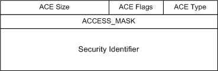

# Access Control Entry

## 

An access control entry (ACE) describes access rights associated with a particular SID. The access control entry is evaluated by the operating system in order to compute the effective access granted to a particular program based upon its credentials. For example, when a user logs on to the computer, and then executes a program, the program uses the credentials associated with that particular user's account.

Thus, when a program attempts to open an object, Windows compares the credentials associated with the program against the security controls associated with the object. The security reference monitor then uses the ACE information to determine if the program should be allowed or denied access to the given object. Thus, the ACE determines the behavior of the security subsystem.

The following figure illustrates the access control entry.

There are five types of ACEs used by the security subsystem. The **Type** member of the ACE structure controls the interpretation of the ACE. The defined types are:

-   **ACCESS\_ALLOWED\_ACE\_TYPE**—this type indicates that the ACE specifies access rights that will be granted to the specific SID.

-   **ACCESS\_DENIED\_ACE\_TYPE**—this type indicates that the ACE specifies access rights that are to be denied to the specific SID.

-   **SYSTEM\_AUDIT\_ACE\_TYPE**—this type indicates that the ACE specifies auditing behavior.

-   **SYSTEM\_ALARM\_ACE\_TYPE**—this type indicates that the ACE specifies alarm behavior.

-   **ACCESS\_ALLOWED\_COMPOUND\_ACE\_TYPE**—this type indicates that the ACE is tied to a particular server and the entity it is impersonating.

Thus, three of the types are used to control programmatic access to an object, while the other two are used to control the audit and alarm behavior of the security subsystem when the object is accessed. Note that the actual behavior of the security subsystem is computed by combining the information for some or all of the ACEs associated with the object.

A driver may construct an access control entry of ACCESS\_ALLOWED\_ACE\_TYPE using the routine [**RtlAddAccessAllowedAce**](https://msdn.microsoft.com/library/windows/hardware/ff552092). For adding the other types of ACE entries, driver writers must construct their own functions because the WDK does not provide any other support routines.

 

 

