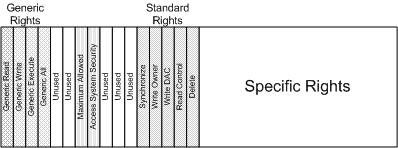

# Access Mask

## 

The function of the access mask is to describe access rights in a compact form. To simplify access management, the access mask contains a set of four bits, the *generic rights*, which are translated into a set of more detailed rights by using the function [**RtlMapGenericMask**](https://msdn.microsoft.com/library/windows/hardware/ff562027).

The following figure illustrates the access mask.

The generic rights are one of the following:

-   GENERIC\_READ—the right to read the information maintained by the object.

-   GENERIC\_WRITE—the right to write the information maintained by the object.

-   GENERIC\_EXECUTE—the right to execute or alternatively look into the object.

-   GENERIC\_ALL—the right to read, write, and execute the object.

Note that these rights can be combined (GENERIC\_READ and GENERIC\_WRITE can both be requested, for example) with the resulting mapping requiring the union of the rights needed for each generic right. This paradigm mimics UNIX "rwx" access bits that are used to control access to UNIX resources. The generic rights in the access mask simplify application development on Windows since these rights mask the different security rights for various object types.

The following set of *standard rights* are applicable to all object types:

-   DELETE—the right to delete the particular object.

-   READ\_CONTROL—the right to read the control (security) information for the object.

-   WRITE\_DAC—the right to modify the control (security) information for the object.

-   WRITE\_OWNER—the right to modify the owner SID of the object. Recall that owners always have the right to modify the object.

-   SYNCHRONIZE—the right to wait on the given object (assuming that this is a valid concept for the object).

The lower 16 bits of the access mask represent the specific rights. The meaning of these specific rights is unique to the object in question. For file systems, the primary interests are the specific rights for file objects. For file objects, specific rights are normally interpreted differently, depending upon whether the file object represents a file or a directory. For files, the normal interpretation is:

-   **FILE\_READ\_DATA**—the right to read data from the given file.

-   **FILE\_WRITE\_DATA**—the right to write data to the given file (within the existing range of the file).

-   **FILE\_APPEND\_DATA**—the right to extend the given file.

-   **FILE\_READ\_EA**—the right to read the extended attributes of the file.

-   **FILE\_WRITE\_EA**—the right to modify the extended attributes of the file.

-   **FILE\_EXECUTE**—the right to locally execute the given file. Executing a file stored on a remote share requires read permission, since the file is read from the server, but executed on the client.

-   **FILE\_READ\_ATTRIBUTES**—the right to read the file's attribute information.

-   **FILE\_WRITE\_ATTRIBUTES**—the right to modify the file's attribute information.

For directories, the same bit values are used, but their interpretation is different in some of the following cases:

-   **FILE\_LIST\_DIRECTORY**—the right to list the contents of the directory.

-   **FILE\_ADD\_FILE**—the right to create a new file within the directory.

-   **FILE\_ADD\_SUBDIRECTORY**—the right to create a new directory (subdirectory) within the directory.

-   **FILE\_READ\_EA**—the right to read the extended attributes of the given directory.

-   **FILE\_WRITE\_EA**—the right to write the extended attributes of the given directory.

-   **FILE\_TRAVERSE**—the right to access objects within the directory. The FILE\_TRAVERSE access right is different than the FILE\_LIST\_DIRECTORY access right. Holding the FILE\_LIST\_DIRECTORY access right allows an entity to obtain a list of the contents of a directory, while the FILE\_TRAVERSE access right gives an entity the right to access the object. A caller without the FILE\_LIST\_DIRECTORY access right could open a file that it knew already existed, but would not be able to obtain a list of the contents of the directory.

-   **FILE\_DELETE\_CHILD**—the right to delete a file or directory within the current directory.

-   **FILE\_READ\_ATTRIBUTES**—the right to read a directory's attribute information.

-   **FILE\_WRITE\_ATTRIBUTES**—the right to modify a directory's attribute information.

The actual mapping of generic rights to standard and specific rights for file objects is defined by the I/O manager. This mapping can be retrieved by a file system using [**IoGetFileObjectGenericMapping**](https://msdn.microsoft.com/library/windows/hardware/ff549231). Normally, this mapping is done during IRP\_MJ\_CREATE processing by the I/O manager prior to calling the file system. But this might be done by a file system checking security on specific operations (specialized FSCTL operations, for example).

 

 

