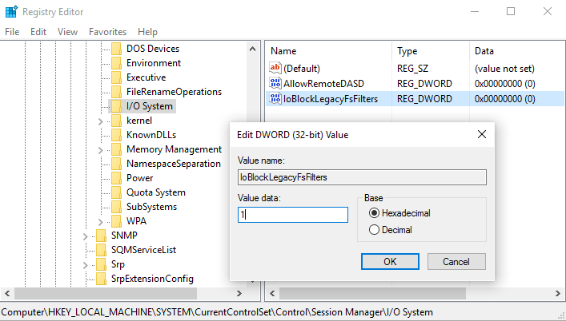

# Blocking legacy file system filter drivers

Starting in Windows 10, version 1607, administrators and driver developers can use a registry setting to block legacy file system filter drivers. *Legacy file system filter drivers* are drivers that attach to the file system stack directly and don't use Filter Manager. This topic describes the registry setting for blocking and unblocking legacy file system filter drivers. It also describes the event entered into the System event log when a legacy file system filter is blocked and how to check if the OS has legacy file system drivers running.

<div class="alert">
<strong>Note</strong>   For optimal reliability and performance, we recommend using <a href="filter-manager-and-minifilter-driver-architecture.md" data-raw-source="[file system minifilter drivers](filter-manager-and-minifilter-driver-architecture.md)">file system minifilter drivers</a> instead of legacy file system filter drivers. Also, legacy file system filter drivers can’t attach to direct access (DAX) volumes. For more about file system minifilter drivers, see <a href="advantages-of-the-filter-manager-model.md" data-raw-source="[Advantages of the Filter Manager Model](advantages-of-the-filter-manager-model.md)">Advantages of the Filter Manager Model</a>. To port your legacy driver to a minifilter driver, see <a href="guidelines-for-porting-legacy-filter-drivers.md" data-raw-source="[Guidelines for Porting Legacy Filter Drivers](guidelines-for-porting-legacy-filter-drivers.md)">Guidelines for Porting Legacy Filter Drivers</a>.
</div>
 

## <span id="How_to_block_legacy_drivers"></span><span id="how_to_block_legacy_drivers"></span><span id="HOW_TO_BLOCK_LEGACY_DRIVERS"></span>How to block legacy drivers


Use the **IoBlockLegacyFsFilters** registry key to specify if the system blocks legacy file system filter drivers. When blocked, all legacy file system filter drivers are blocked from loading. For the registry changes to take effect, perform a system restart.

The registry key must be created under the following registry path:

``` syntax
HKEY_LOCAL_MACHINE\SYSTEM\CurrentControlSet\Control\Session Manager\I/O System
```

The valid DWORD values for the **IoBlockLegacyFsFilters** key are as follows:

| **IoBlockLegacyFsFilters** value | Description                                                                                       |
|----------------------------------|---------------------------------------------------------------------------------------------------|
| **1**                            | Legacy file system filter drivers are blocked from loading or attaching to storage volumes.       |
| **0**                            | Legacy file system filter drivers are not blocked. In this release, this is the default behavior. |

 

This is what the key looks like in Registry Editor:



## <span id="Example__when__a_legacy_driver_is_blocked_from_loading"></span><span id="example__when__a_legacy_driver_is_blocked_from_loading"></span><span id="EXAMPLE__WHEN__A_LEGACY_DRIVER_IS_BLOCKED_FROM_LOADING"></span>Example: when a legacy driver is blocked from loading


An **Error** event is logged to the System event log when a legacy file system filter driver is blocked from loading, as shown here:

<table>
<colgroup>
<col width="50%" />
<col width="50%" />
</colgroup>
<thead>
<tr class="header">
<th align="left">Event property</th>
<th align="left">Description</th>
</tr>
</thead>
<tbody>
<tr class="odd">
<td align="left">Log Name</td>
<td align="left">System</td>
</tr>
<tr class="even">
<td align="left">Source</td>
<td align="left">Microsoft-Windows-Kernel-IO</td>
</tr>
<tr class="odd">
<td align="left">Date</td>
<td align="left">12/29/2015 2:55:05 PM</td>
</tr>
<tr class="even">
<td align="left">Event ID</td>
<td align="left">1205</td>
</tr>
<tr class="odd">
<td align="left">Task Category</td>
<td align="left">None</td>
</tr>
<tr class="even">
<td align="left">Level</td>
<td align="left">Error</td>
</tr>
<tr class="odd">
<td align="left">Keywords</td>
<td align="left"></td>
</tr>
<tr class="even">
<td align="left">User</td>
<td align="left">CONTOSO\user</td>
</tr>
<tr class="odd">
<td align="left">Computer</td>
<td align="left">user.domain.corp.contoso.com</td>
</tr>
<tr class="even">
<td align="left">Description</td>
<td align="left">Windows is configured to block legacy file system filters. Filter name: \Driver\sfilter</td>
</tr>
</tbody>
</table>

 

## <span id="How_to_check_if_legacy_drivers_are_running"></span><span id="how_to_check_if_legacy_drivers_are_running"></span><span id="HOW_TO_CHECK_IF_LEGACY_DRIVERS_ARE_RUNNING"></span>How to check if legacy drivers are running


If you're unsure which filters are legacy file system filter drivers or want to make sure that they're not running, you can perform the following:

**To check if legacy file system filter drivers are running**

1.  Open an elevated Command Prompt by right-clicking a **cmd.exe** icon and clicking **Run as administrator**.
2.  Type: `fltmc filters`
3.  Look for legacy drivers, they're the ones with a **Frame** value of **&lt;Legacy&gt;**.

In this example, the legacy file system filter drivers, named AVLegacy and EncryptionLegacy, are marked with the **&lt;Legacy&gt;** Frame value. The file system driver named AVMiniFilter does not have the **&lt;Legacy&gt;** Frame value because it is a minifilter driver (it does not attach to the file system stack directly and uses Filter Manager).

``` syntax
C:\Windows\system32>fltmc filters
 
Filter Name                     Num Instances    Altitude    Frame
------------------------------  -------------  ------------  -----
AVLegacy                                        389998.99   <Legacy>
EncryptionLegacy                                149998.99   <Legacy>
AVMiniFilter                           3        328000         0
```

If you see that legacy drivers are still running after you block legacy file system filter drivers, make sure you reboot the system after setting the **IoBlockLegacyFsFilters** registry key. The setting will not take effect until after a reboot.

If your system has legacy file system filter drivers, work with the respective ISVs to get the Minifilter version of the file system driver. For info about porting legacy file system filter drivers to minifilter drivers that use the Filter Manager model, see [Guidelines for Porting Legacy Filter Drivers](guidelines-for-porting-legacy-filter-drivers.md).

 

 


