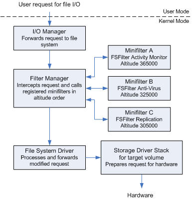
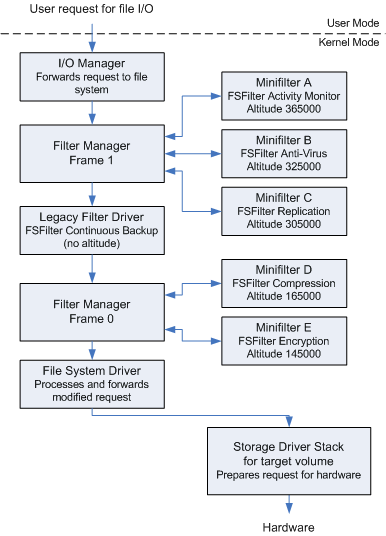

# Filter Manager Concepts

The filter manager (*FltMgr.sys*) is a system-supplied kernel-mode driver that implements and exposes functionality commonly required in file system filter drivers. By taking advantage of this functionality, third-party developers can write "minifilter" filter drivers, which are simpler to develop than legacy file system filter drivers, thus shortening the development process while producing higher-quality, more robust drivers.

*FltMgr* is installed with Windows, but becomes active only when a minifilter driver is loaded. It attaches to the file system stack for a target volume. A minifilter driver attaches to the file system stack indirectly, by registering with *FltMgr* for the I/O operations that the minifilter driver chooses to filter.

Minifilters attach in a particular order. The order of attachment is determined by [load order groups and altitudes](load-order-groups-and-altitudes-for-minifilter-drivers.md). The attachment of a minifilter driver at a particular altitude on a particular volume is called an *instance* of the minifilter driver.

A minifilter's altitude ensures that the instance of the minifilter driver is always loaded at the appropriate location relative to other minifilter driver instances, and it determines the order in which *FltMgr* calls the minifilter driver to handle I/O.

The following figure shows a simplified I/O stack with the filter manager and three minifilter drivers.

A minifilter driver can filter IRP-based I/O operations as well as fast I/O and file system filter (FSFilter) callback operations. For each of the I/O operations it chooses to filter, a minifilter can register a [preoperation callback routine](writing-preoperation-and-postoperation-callback-routines.md), a postoperation callback routine, or both. When handling an I/O operation, *FltMgr* calls the appropriate callback routine for each minifilter driver that registered for that operation. When that callback routine returns, *FltMgr* calls the appropriate callback routine for the next minifilter driver that registered for the operation.

For example, assuming all three minifilter drivers in the above figure registered for the same I/O operation, the filter manager would call their preoperation callback routines in order of altitude from highest to lowest (A, B, C), then forward the I/O request to the next-lower driver for further processing. When the filter manager receives the I/O request for completion, it calls each minifilter driver's postoperation callback routines in reverse order, from lowest to highest (C, B, A).

For interoperability with legacy filter drivers, *FltMgr* can attach filter device objects to a file system I/O stack in more than one location. Each of *FltMgr*'s filter device objects is called a *frame*. From the perspective of a legacy filter driver, each filter manager frame is just another legacy filter driver.

Each filter manager frame represents a range of altitudes. The filter manager can adjust an existing frame or create a new frame to allow minifilter drivers to attach at the correct location.

The filter manager cannot attach a minifilter between two attached legacy filters unless there is already a filter manager frame between them. If a minifilter is intended to be attached above a legacy filter, it can be attached below it, depending on the existence of a second attached legacy filter. A minifilter intended to be attached below a legacy filter could, instead, be attached above that legacy filter.

> [!IMPORTANT]
> Always verify interoperability of legacy filters with minifilters or consider replacing legacy filters with minifilters. For more information, see [Guidelines for Porting Legacy Filter Drivers](guidelines-for-porting-legacy-filter-drivers.md).

If a minifilter driver is unloaded and reloaded, it is reloaded at the same altitude in the same frame from which it was unloaded.

The following figure shows a simplified I/O stack with a two filter manager frames, minifilter driver instances, and a legacy filter driver.

