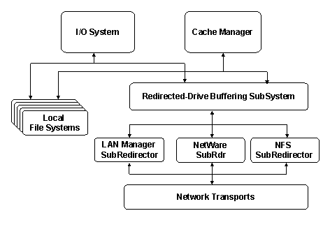

# Network Redirector Design in Windows 2000

## 

A significant challenge in the design of network redirectors is the relatively complex translation that is performed from user-initiated operations to low-level network operations, both with respect to operation selection and timing. Dealing with the Windows I/O System, Cache Manager, and Memory Manager is a relatively complex undertaking. This is especially true when considering the variety of buffering modes that may be appropriate for a remote communication mechanism, such as a computer network where the speed and reliability may vary considerably. The implementation of these buffering operations in a network redirector represents a significant investment in function that would ideally be shared and reused by drivers.

Windows 2000 introduced a new driver model (often called the mini-redirector architecture, or rdr2) for network redirectors based on a layered or miniport driver approach. Rather than having to re-implement the complex code used for buffering and interaction with the I/O Manager and Cache Manager in each driver, this large block of code was pulled out and made available to all potential network redirectors. The shared common buffering code is called the Redirected Drive Buffering SubSystem (RDBSS).

A model of this architecture with multiple redirectors is shown below.

This RDBSS design change offers several of the following benefits:

-   Simplifies the process of writing the kernel driver for a network redirector since a large amount of common code that was needed to deal with the I/O System, Cache Manager, and Memory Manager was provided.

-   Makes available to other network redirector drivers a considerable amount of performance improvements based on buffering algorithms and kernel optimizations developed for Microsoft Networks.

-   Simplifies maintenance since only one copy of the buffering code needs to be developed and maintained. In the older model, a copy was required for each redirector.

-   Provides a strong encapsulation of the network protocol-specific component of a network redirector, so driver developers can focus on these aspects of the network redirector that are unique and specific to their application or product.

-   Simplifies debugging drivers for network redirectors by providing decoupling based on this layered approach.

The RDBSS model was introduced with Windows 2000. This same model is also used on Windows Server 2003 and Windows XP.

 

 

