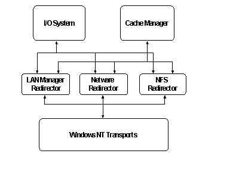

# Network Redirector Design in Windows NT

## 

The architecture that implements a kernel-mode driver for network redirectors has changed over time. The general model for network redirectors has typically been based on the architecture that implements the kernel driver for the Client for Microsoft Networks (LAN Manager Client). The original scheme introduced in Windows NT 3.0 used no shared components and was limited. This model is often called the original rdr driver model (rdr was an abbreviation for redirector). No special support from the operating system was provided to simplify the process of writing a network redirector. Each kernel-mode driver implemented all of the functions required for a network redirector. Consequently, each kernel driver would include a large amount of code for interactions with the I/O Manager, Cache Manager, and Memory Manager. Each network redirector (LAN Manager, NetWare, and NFS, for example) installed on Windows had to implement all of these functions themselves. This design model was used for drivers for network redirectors through Windows NT 4.0. The following is a diagram of this architecture, with multiple redirectors.

 

 

