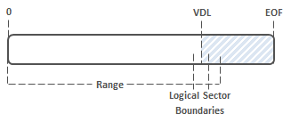

# Offloaded Data Transfers

Transferring data between computers or within the same computer is a frequent file system activity. Using the standard **ReadFile** and **WriteFile** functions work well from a functional point of view, but it involves heavy data movement through all levels of the system and potentially across a network. This can affect the availability of the systems involved in the transfer and the network connecting the systems. The advanced capabilities available with many storage subsystems provide a more efficient means of performing the ‘heavy lifting’ task of data movement.

Starting with Windows 8, applications can take advantage of these capabilities to help offload the process of data movement to the storage subsystem. File system filters can typically monitor these actions by intercepting read and write requests to a volume. Additional actions are required for filters to be aware of offloaded data transfers.

## Typical Data Transfers

Moving data around in an application scenario today is quite simple. It involves reading the data into local memory, then writing it back out to a new location. The following diagram illustrates this scenario.

This scenario involves copying a file between two locations on two different file servers, each with its own virtual disk exposed through an Intelligent Storage Array (ISA). The initiating system first needs to read the data from the source virtual disk into a local buffer. It then packages and transmits the data through some transport and protocol (like SMB over 1GbE) to the second system, which then receives the data and outputs it to a local buffer. Then, the target system writes the data to the destination virtual disk. This scenario describes a very typical Read/Write method of data transfer that is performed multiple times by many different applications every day.

While standard reads and writes work well in most scenarios, the data intending to be copied may be located on virtual disks managed by the same Intelligent Storage Array. This means that the data is moved out of the array, onto a server, across a network transport, onto another server, and back into the same array once again. The act of moving data within a server and across a network transport can significantly impact the availability of those systems; not to mention the fact that the throughput of the data movement is limited by the throughput and availability of the network.

## Offloaded Data Transfers (ODX)

### Offloading the Data Transfer

Two new FSCTLs are introduced in Windows 8 that facilitate a method of offloading the data transfer. This shifts the burden of bit movement away from servers to bit movement that occurs intelligently within the storage subsystems. The best way to visualize the command semantics is to think of them as analogous to an unbuffered read and an unbuffered write.

[**FSCTL\_OFFLOAD\_READ**](https://msdn.microsoft.com/library/windows/hardware/hh451101)  
This control request takes an offset within the file to be read and a desired length in the [**FSCTL\_OFFLOAD\_READ\_INPUT**](https://msdn.microsoft.com/library/windows/hardware/hh451104) structure. If supported, the storage subsystem hosting the file receives the associated offload read storage command and generates a token, which is a logical representation of the data intended to be read at the time of the offload read command. This token string is returned to the caller in the [**FSCTL\_OFFLOAD\_READ\_OUTPUT**](https://msdn.microsoft.com/library/windows/hardware/hh451109) structure.

[**FSCTL\_OFFLOAD\_WRITE**](https://msdn.microsoft.com/library/windows/hardware/hh451122)  
This control request takes an offset within the file to be written to, the desired length of the write, and the token that is a logical representation of the data to be written. If supported, the storage subsystem hosting the file to be written receives the associated offload write storage command. It first attempts to recognize the given token, and then performs the write operation if possible. The write operation is completed underneath Windows, and therefore components on the file system and storage stacks will not see the data movement. Once the data movement is complete, the number of bytes written is returned to the caller.

Similar to the first diagram, a simple file copy between two virtual disks on two different servers is shown. Instead of doing normal reads and writes, we offload the heavy lifting of bit movement to the storage array. The first system issues the offload read operation, requesting the array to generate a token representing a point-in-time view of the data to be read within the region of the first virtual disk. The first system then transmits the token to the second system, which in turn issues an offload write operation to the second virtual disk with the token. The array then interprets the token and attempts to perform the data movement between the virtual disks. You’ll notice that the actual data transfer occurs within the intelligent storage array, and not between the two hosts. This significantly improves availability of the two systems while virtually eliminating network traffic between the systems.

### Integration with the Copy Engine

The core copy engine in Windows is used by **CopyFile** and related functions. Starting with Windows 8, the copy engine will transparently attempt to use offloaded data transfers before the traditional copy file code path. Since the copy APIs are used by most applications, utilities, and by the shell, these callers are able to use offloaded data transfer capabilities by default with little, if any, code modification or user intervention.

The following steps summarize how the copy engine attempts an offloaded data transfer:

1.  The copy engine issues a [**FSCTL\_OFFLOAD\_READ**](https://msdn.microsoft.com/library/windows/hardware/hh451101) on the source file to get a read token.
2.  If there was a failure in retrieving the read token, the copy engine falls back to traditional reads and writes (the traditional copy file code path). If the failure indicates that the source volume does not support offload, the copy engine also marks the volume in a per-process cache. The copy engine will not try offload any more for the volumes in the per-process cache.
3.  If the token was successfully retrieved, the copy engine attempts to issue [**FSCTL\_OFFLOAD\_WRITE**](https://msdn.microsoft.com/library/windows/hardware/hh451122) commands on the target file in large chunks until all the data that is logically represented by the token has been offload written.
4.  Any errors in performing the offload read or write results in the copy engine falling back to the traditional code path of reads and write, starting from where the offload code path ended off (where the read or write was truncated). If the failure indicates that the destination volume does not support offload, or the source volume cannot reach the destination volume, the copy engine updates the same per-process cache so it will not try offload on these volumes. This per-process cache will reset periodically.

The following functions support offloaded data transfers:

-   **CopyFile**
-   **CopyFileEx**
-   **MoveFile**
-   **MoveFileEx**
-   **CopyFile2**

The following functions do not support offloaded data transfers:

-   **CopyFileTransacted**
-   **MoveFileTransacted**

### Supported Offload Data Transfer Scenarios

Support for the offload operations is provided in the Hyper-V storage stack and in the Windows SMB File Server. Where the backing physical storage supports ODX operations, callers can issue [**FSCTL\_OFFLOAD\_READ**](https://msdn.microsoft.com/library/windows/hardware/hh451101) and [**FSCTL\_OFFLOAD\_WRITE**](https://msdn.microsoft.com/library/windows/hardware/hh451122) to files residing on VHDs or on remote file shares, whether from within a virtual machine or on physical hardware. The following diagram illustrates the most basic supported source and destination targets for offloaded data transfers.

## File System Filter Opt-In Model and Impact to Applications

Filter Manager, starting with Windows 8, allows a filter to specify offload capability as a supported feature. File system filters attached to a volume can collectively determine if a certain offloaded operation is supported or not; if it is not, the operation fails with an appropriate error code.

A filter must indicate that it supports [**FSCTL\_OFFLOAD\_READ**](https://msdn.microsoft.com/library/windows/hardware/hh451101) and [**FSCTL\_OFFLOAD\_WRITE**](https://msdn.microsoft.com/library/windows/hardware/hh451122) through a registry **DWORD** value named **SupportedFeatures**, located in the driver service definition in the registry at HKEY\_LOCAL\_MACHINE\\System\\CurrentControlSet\\Services\\&lt;filter driver name&gt;\\. This value contains bitfields where the bits determine which functionality is opted-in, and should be set during filter installation.

Currently, the defined bits are:

| Flag                                               | Meaning                               |
|----------------------------------------------------|---------------------------------------|
| SUPPORTED\_FS\_FEATURES\_OFFLOAD\_READ 0x00000001  | Filter supports FSCTL\_OFFLOAD\_READ  |
| SUPPORTED\_FS\_FEATURES\_OFFLOAD\_WRITE 0x00000002 | Filter supports FSCTL\_OFFLOAD\_WRITE |

 

The filter opt-in model can be enabled or disabled based on the value present in the HKEY\_LOCAL\_MACHINE\\System\\CurrentControlSet\\Control\\FileSystem\\FilterSupportedFeaturesMode registry key, which has the following values:

| FilterSupportedFeaturesMode Value | Meaning                                                                             |
|-----------------------------------|-------------------------------------------------------------------------------------|
| 0 (Default)                       | Do normal opt-in processing.                                                        |
| 1                                 | Never opt-in (equivalent to setting SupportedFeatures to 0 on all filters attached) |

 

### Testing

To check the supported features of the stack, there is an updated command within the fltmc utility. Run **fltmc instances –v \[volume\]:** as an elevated user, and check the *SprtFtrs* column. If the *SprtFtrs* value for a filter is set to 0, it implies that the filter is blocking offload on this volume. If the *SprtFtrs* field is set to 3, both offload operations are supported.

### Checking Feature Support in IRP Processing

As part of IRP processing, the [**FsRtlGetSupportedFeatures**](https://msdn.microsoft.com/library/windows/hardware/hh920378) routine retrieves the aggregated **SupportedFeatures** state for all filters attached to the given volume stack. Components such as I/O Manager and SRV (SMB) call this routine to validate the **SupportedFeatures** state for all the filters on the stack. Components that roll their own offload IRPs should call this function to validate opt-in support for that operation.

### Considerations for Filter Drivers

Offloaded data transfer is a new way to move data around in the data center. Due to the integration of offload logic in the core copy engine, many applications by default will have the ability to perform offloaded data movement without explicitly opting in. As a result, filter developers need to understand how these new operations impact filters. Not understanding these operations fully or not evaluating the new data flow can potentially result in scenarios where data can become inconsistent or corrupted. The following list summarizes a set of action items for filter developers to take note of with offload:

-   Understand the new data flow, the impact to the filter, and the ability of the filter to support these offloaded operations.
-   Update your filter installer to add a REG\_DWORD value for **SupportedFeatures** to the HKLM\\System\\CurrentControlSet\\Services\\\[filter\] subkey. Initialize it to specify offload functionality.
-   For filters that want to act upon offload operations, update the registration to **IRP\_MJ\_FILE\_SYSTEM\_CONTROL** to handle [**FSCTL\_OFFLOAD\_READ**](https://msdn.microsoft.com/library/windows/hardware/hh451101) and [**FSCTL\_OFFLOAD\_WRITE**](https://msdn.microsoft.com/library/windows/hardware/hh451122).
-   For filters that need to block offloaded operations, return the status code STATUS\_NOT\_SUPPORTED from within the filter. Do not rely upon the registry value to enforce blocking offload operations since it can be changed by end users. A filter should explicitly allow or disallow offload operations.

## Copy Tokens

With offloaded operations, the file data is not seen by the I/O stack. Instead it is seen as a 512-byte token that is the logical proxy for the data. This token is either an opaque and unique string of a vendor-specific format generated by the storage subsystem, or can be of a well-known type to represent a pattern of data (such as a data range that is logically equivalent to zero). Modifications to the data that the token is a proxy for will either result in invalidating the token, or for the storage subsystem to persist the original data by some vendor-specific means (such as through a snapshot mechanism). Subsequent offload read requests to a specified range in a file results in unique tokens.

There are classes of tokens that represent a pattern of data that is well defined. The most common well known token is the Zero Token which is equivalent to zero. When a token is defined as a Well Known Token, the **TokenType** member in the **STORAGE\_OFFLOAD\_TOKEN** structure will be set to STORAGE\_OFFLOAD\_TOKEN\_TYPE\_WELL\_KNOWN. When this field is set, the **WellKnownPattern** member determines which pattern of data the token is.

-   When the **WellKnownPattern** field is set to STORAGE\_OFFLOAD\_PATTERN\_ZERO or STORAGE\_OFFLOAD\_PATTERN\_ZERO\_WITH\_PROTECTION\_INFORMATION, it indicates the Zero Token. When this token is returned by a [**FSCTL\_OFFLOAD\_READ**](https://msdn.microsoft.com/library/windows/hardware/hh451101) operation, it indicates that the data contained within the desired file range is logically equivalent to zero. When this token is provided to a [**FSCTL\_OFFLOAD\_WRITE**](https://msdn.microsoft.com/library/windows/hardware/hh451122) operation, it indicates that the desired range of the file to be written to should be logically zeroed.
-   Other than the Zero Token, there are no other Well Known Token patterns currently defined. It is not recommended that users define their own Well Known Token patterns.

## Truncation

The underlying storage subsystem that Windows communicates with can process less data that was desired in an offload operation. This is called truncation. With offload read, this means that the returned token represents a range of the data less than that which was requested. This is indicated by the **TransferLength** member in the [**FSCTL\_OFFLOAD\_READ\_OUTPUT**](https://msdn.microsoft.com/library/windows/hardware/hh451109) structure, which is a byte count from the beginning of the range of the file to be read. For offload write, a truncation indicates that less data was written than was desired. This is indicated by the **LengthWritten** member in the [**FSCTL\_OFFLOAD\_WRITE\_OUTPUT**](https://msdn.microsoft.com/library/windows/hardware/hh451130) structure, which is a byte count from the beginning of the range of the file to be written. Errors in command processing, or limitations within the stack for large ranges, result in truncation.

There are two scenarios in which NTFS truncates the range to be offload read or written:

1.  The copy range will be truncated to Valid Data Length (VDL) if VDL is before the End of the File (EOF). This assumes that VDL is aligned to a logical sector boundary, otherwise see scenario.

    

    During a [**FSCTL\_OFFLOAD\_READ**](https://msdn.microsoft.com/library/windows/hardware/hh451101) operation, the flag OFFLOAD\_READ\_FLAG\_ALL\_ZERO\_BEYOND\_CURRENT\_RANGE is set in the [**FSCTL\_OFFLOAD\_READ\_OUTPUT**](https://msdn.microsoft.com/library/windows/hardware/hh451109) structure indicating that the rest of the file contains zeros, and the **TransferLength** member is truncated to VDL.

2.  Similar to Scenario 1, but when VDL is not aligned to a logical sector boundary, the desired range is truncated by NTFS to the next logical sector boundary.

    

## Limitations

-   Offload operations are supported only on NTFS volumes.
-   Offload operations are supported through remote file servers if the remote share is a NTFS volume and if the server is running Windows Server 2012 (assuming the remote stack also supports offload operations).
-   NTFS does not support offload FSCTLs performed on files encrypted with Bitlocker or NTFS encryption (EFS), de-duplicated files, compressed files, resident files, sparse files, or files participating in TxF transactions.
-   NTFS does not support offload FSCTLs performed on files within a volsnap snapshot.
-   NTFS will fail the offload FSCTL if the desired file range is unaligned to the logical sector size on the source device or if the desired file range is unaligned to the logical sector size on the destination device. This follows the same semantics as non-cached IO.
-   The destination file must be pre-allocated (**SetEndOfFile** and not **SetAllocation**) before [**FSCTL\_OFFLOAD\_WRITE**](https://msdn.microsoft.com/library/windows/hardware/hh451122).
-   In processing offload read and offload write, NTFS first calls [**CcCoherencyFlushAndPurgeCache**](https://msdn.microsoft.com/library/windows/hardware/ff539032) to commit any modified data in the system cache. This is the same semantic as non-cached IO.

 

 

