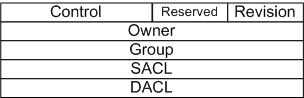

# Security Descriptors

## 

Windows file systems may support the storage and management of security descriptors associated with individual storage units within the file system. The granularity of security control is entirely up to the file system. For example, one file system might maintain a single security descriptor that covers everything on a given storage volume, while another might provide security descriptors that cover different parts of a single given file. The models with which most developers will be comfortable are those provided by the existing Windows file systems:

-   NTFS—supports a per-file (or directory) security descriptor model. NTFS is efficient in its storage of security descriptors, storing only a single copy of each security descriptor, even if it is used by many different files.

-   FAT, CDFS, UDFS—do not support security descriptors.

-   RDBSS and the SMB Network Redirector—provide support comparable to that provided by the remote volume.

These file systems, however, do not represent all possible implementations of Windows security for file systems.

A Windows security descriptor consists of four distinct pieces:

-   The security identifier (SID) of the owner of the object. An object's owner always has the ability to reset the security on the object. This is a good way to ensure that, for example, all access to an object can be removed. Because even if owners remove their ability to perform all operations, this inherent right allows them to restore their security rights on the object.

-   An optional security identifier (SID) of the default group of the object. The concept of group ownership is one that is not required in Windows, but is useful for some applications.

-   The system access control list (SACL) that describes the auditing policy of the security descriptor.

-   The discretionary access control list (DACL) that describes the access policy of the security descriptor.

The following figure illustrates a windows security descriptor.

Security descriptors are variable-sized objects, with each of the individual sub-components being variable in size as well. To facilitate offline storage of security descriptors, a security descriptor may be in self-relative format, in which case the header is the offset within the buffer to the specific component of the security descriptor. An in-memory format consists of pointer values to the various parts of the security descriptor. For a file system, the self-relative format is normally the most useful because it allows for simple storage and retrieval of the security descriptor from persistent storage. Applications that build security descriptors are more likely to use the in-memory format. The security reference monitor provides conversion routines to convert from one format to the other.

This section includes the following topics:

[Security Identifier](security-identifier.md)

[Access Mask](access-mask.md)

[Access Control Entry](access-control-entry.md)

[Access Control List](access-control-list.md)

 

 

[Send comments about this topic to Microsoft](mailto:wsddocfb@microsoft.com?subject=Documentation%20feedback%20[ifsk\ifsk]:%20Security%20Descriptors%20%20RELEASE:%20%285/9/2016%29&body=%0A%0APRIVACY%20STATEMENT%0A%0AWe%20use%20your%20feedback%20to%20improve%20the%20documentation.%20We%20don't%20use%20your%20email%20address%20for%20any%20other%20purpose,%20and%20we'll%20remove%20your%20email%20address%20from%20our%20system%20after%20the%20issue%20that%20you're%20reporting%20is%20fixed.%20While%20we're%20working%20to%20fix%20this%20issue,%20we%20might%20send%20you%20an%20email%20message%20to%20ask%20for%20more%20info.%20Later,%20we%20might%20also%20send%20you%20an%20email%20message%20to%20let%20you%20know%20that%20we've%20addressed%20your%20feedback.%0A%0AFor%20more%20info%20about%20Microsoft's%20privacy%20policy,%20see%20http://privacy.microsoft.com/default.aspx. "Send comments about this topic to Microsoft")

