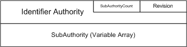

# Security Identifier


## <span id="ddk_security_identifier_if"></span><span id="DDK_SECURITY_IDENTIFIER_IF"></span>


The security identifier is used by Windows as the definitive value to distinguish security entities from one another. For example, a unique security identifier is assigned to each new account created for individual users on the system. For a file system, only this SID is actually used.

The following figure illustrates the security identifier structure.



In addition to unique SIDs, the Windows system defines a set of well known identifiers. For example, the local Administrator is such a well-known SID. Windows provides an in-kernel mechanism for converting between SIDs and user names within the kernel environment. These function calls are available from the ksecdd driver, which implements these functions by using user-mode helper services. Accordingly, their use within file systems must obey the usual rules for communication with user-mode services. These calls cannot be used during paging file I/O.

The functions include the following:

-   [**SecMakeSPN**](https://msdn.microsoft.com/library/windows/hardware/ff556584)—creates a service provider name string that can be used when communicating with specific security service providers.

-   [**SecMakeSPNEx**](https://msdn.microsoft.com/library/windows/hardware/ff556585)—an augmented version of **SecMakeSPN**. This function is available on Microsoft Windows XP and later versions of Windows.

-   [**SecMakeSPNEx2**](https://msdn.microsoft.com/library/windows/hardware/ff556592)—an augmented version of **SecMakeSPNEx**. This function is available on Windows Vista, Windows Server 2008, and later versions of Windows.

-   [**SecLookupAccountSid**](https://msdn.microsoft.com/library/windows/hardware/ff556579)—given a SID, this routine will return an account name. This function is available on Windows XP and later.

-   [**SecLookupAccountName**](https://msdn.microsoft.com/library/windows/hardware/ff554795)—given an account name, this routine will retrieve the SID. This function is available on Windows XP and later.

-   [**SecLookupWellKnownSid**](https://msdn.microsoft.com/library/windows/hardware/ff556582)—given a well known SID type, this routine will return the correct SID. This function is available on Windows Server 2003 and later.

In addition, any kernel driver may create a SID by using the following standard runtime library routines:

-   [**RtlInitializeSid**](https://msdn.microsoft.com/library/windows/hardware/ff552998)—initializes a buffer for a new SID.

-   [**RtlLengthSid**](https://msdn.microsoft.com/library/windows/hardware/ff553085)—determines the size of the SID stored within the given buffer.

-   [**RtlValidSid**](https://msdn.microsoft.com/library/windows/hardware/ff553314)—determines if the given SID buffer is a valid formatted buffer.

Note that **RtlLengthSid** and **RtlValidSid** assume that the 8-byte fixed header for a SID is present. So a driver should check for this minimum length for a SID header before calling these functions.

While there are several other RTL functions, these are the primary functions necessary when constructing a SID.

The following code example demonstrates how to create a SID for the "local system" entity:

```cpp
{
    //
    // temporary stack-based storage for an SID
    //
    UCHAR sidBuffer[128];
    PISID localSid = (PISID) sidBuffer;
    SID_IDENTIFIER_AUTHORITY localSidAuthority = 
        SECURITY_NT_AUTHORITY;

    //
    // build the local system SID
    //
    RtlZeroMemory(sidBuffer, sizeof(sidBuffer));
 
    localSid->Revision = SID_REVISION;
    localSid->SubAuthorityCount = 1;
    localSid->IdentifierAuthority = localSidAuthority;
    localSid->SubAuthority[0] = SECURITY_LOCAL_SYSTEM_RID;
 
    //
    // make sure it is valid
    //
    if (!RtlValidSid(localSid)) {
        DbgPrint("no dice - SID is invalid\n");
        return(1);
    }
}
```

Note that this could have also been done using the simpler function **SecLookupWellKnownSid** introduced in Windows Server 2003.

The following code example demonstrates how to create a SID using the **SecLookupWellKnownSid** function for the "local system" entity:

```cpp
{
    UCHAR sidBuffer[128];
    PISID localSid = (PISID) sidBuffer;
    SIZE_T sidSize;
    status = SecLookupWellKnownSid(WinLocalSid,
                                   &localSid,
                                   sizeof(sidBuffer),
                                   &sidSize);

    if (!NT_SUCCESS(status)) {
      //
      // error handling
      //
    }
  }
```

Either of these approaches are valid, although the latter code is preferred. Note that these code examples use local buffers for storing the SID. These buffers cannot be used outside the current call context. If the SID buffer needed to be persistent, the buffer should be allocated from pool memory.

 

 


