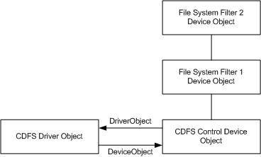
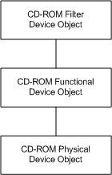
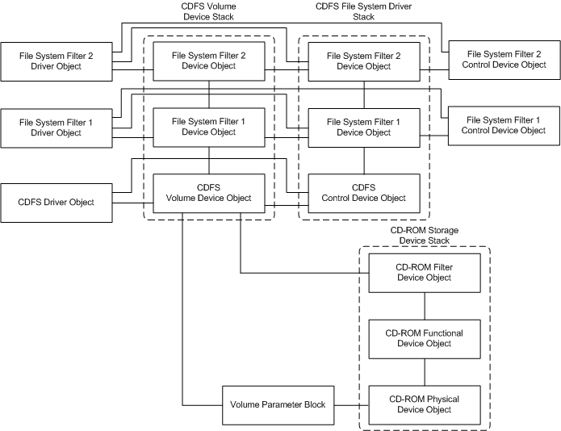

# Volume Mount Example

> [!NOTE]
> For optimal reliability and performance, use [file system minifilter drivers](./filter-manager-concepts.md) with Filter Manager support instead of legacy file system filter drivers. To port your legacy driver to a minifilter driver, see [Guidelines for Porting Legacy Filter Drivers](guidelines-for-porting-legacy-filter-drivers.md).

The following figure shows what CDFS might look like before it has mounted any volumes. In this example, two filters have attached themselves to the CDFS control device object. (Note: The global file system queue that contains the CDFS control device object is not shown.)

The following figure shows a typical driver stack for a CD-ROM storage device that has not yet been mounted as a CDFS volume.

The following figure shows what the file system driver stack, volume stack, and CD-ROM storage device stack look like after the CDFS file system has mounted a volume on a CD-ROM device.

Some notes about the preceding figure:

- The CDFS control device object forms the base of a file system driver stack. This stack, which is not mounted on a storage device, can receive IRPs directly, and can also contain file system filter device objects. Filters attach to file system control device objects to watch for volume mount ([**IRP_MJ_FILE_SYSTEM_CONTROL**](./irp-mj-file-system-control.md), IRP_MN_MOUNT_VOLUME) requests. File system control device objects are required to be named. This distinguishes them from file system volume device objects, which are never named.

- As the diagram shows, although it would be possible to attach a second storage filter to the top of the CD-ROM storage device stack after the CDFS volume has been mounted, this filter would not receive any IRPs that are passed down from the file system stack to the storage device stack. However, it would receive any IRPs that are sent directly to the storage device stack.

- It is important to note that, after the file system has mounted the volume, the storage device stack can still receive IRPs directly. Specifically, power IRPs (IRP_MJ_POWER) are always sent directly to the storage device stack, never to the file system stack. (Thus, for example, file system filter drivers should never register a dispatch routine for IRP_MJ_POWER in their **DriverEntry** routines.)

  However, PnP IRPs ([**IRP_MJ_PNP**](./irp-mj-pnp.md)) can be sent to either stack. Filter drivers chained above a file system volume should always pass these IRPs down to the next lower driver by default so that the file system's volume device can pass the IRPs down to the storage device stack.
