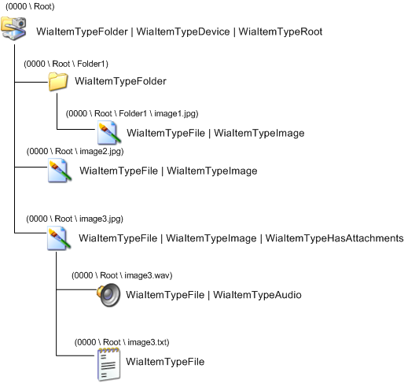

# Adding Attachments to Images

When an item is marked with **WiaItemTypeHasAttachments**, this means that the item has associated attachments, which are stored as child items. This is not the same as an item of type **WiaItemTypeFolder**. The main differences are:

-   Items of type **WiaItemTypeHasAttachments** have only one level of children. Items of type **WiaItemTypeFolder** can have any number of levels of children.

-   All children of an item of type **WiaItemTypeHasAttachments** are related to that item. For example, if an image item has associated audio data, the audio data would be stored as a child of the image item, and the image item would be marked with **WiaItemTypeHasAttachments**.

An item cannot be both of type **WiaItemTypeHasAttachments** and type **WiaItemTypeFolder**. However, an item can be of type **WiaItemTypeHasAttachments** and type **WiaItemTypeFile**. This is because an item of type **WiaItemTypeHasAttachments** is conceptually treated as a single entity. The following diagram illustrates the WIA Camera item tree with attachments.

 

 

