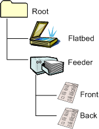

# Advanced Duplex-Capable Document Feeder

## 

Advanced duplex scanning allows the application to independently configure the front and back page settings.

The following diagram illustrates the WIA item tree of a flatbed scanner that supports advanced duplex and document feeder scanning.

Note that the front and back of the page that is being scanned are represented by separate child items in the item tree. This differentiation includes separate categories in the [**WIA\_IPA\_ITEM\_CATEGORY**](https://msdn.microsoft.com/library/windows/hardware/ff551581) property: WIA\_CATEGORY\_FRONT and WIA\_CATEGORY\_BACK. In a scanner that performs advanced duplex scanning, the front and back items are set separately; they may be set to different values. However, even on a scanner that is capable of advanced duplex scanning, there cannot be only a front or back item; if there is either a front or back item, the other item must also be present.

The driver indicates that there are independent settings for the front and back items (that is, an advanced duplex scan is to be performed) by setting the ADVANCED\_DUP flag in the feeder's [**WIA\_DPS\_DOCUMENT\_HANDLING\_CAPABILITIES**](https://msdn.microsoft.com/library/windows/hardware/ff551379) property.

### Scanning

Applications navigate to the feeder item to perform document feeder scans. The WIA properties on the feeder item should be a subset of the supported property values that are common to both the front and back pages. Applications can choose to use two types of data transfers (standard image acquisition or folder acquisition) that affect which document feeder settings are used.

### Standard Image Acquisition

In standard acquisition or non-folder acquisition, the WIA feeder item property settings are used for both front and back pages (the same as the simple duplex and non-duplex scanner models).

### Folder Image Acquisition

In folder acquisition, the WIA feeder item's image settings are ignored and settings for the front and back items are used instead. Advanced applications use the individual configurable settings for the document feeder transfer. On a feeder scanner, the image data is always acquired off the feeder item, even when there are child items (front and back items).

 

 

--------------------
[Send comments about this topic to Microsoft](mailto:wsddocfb@microsoft.com?subject=Documentation%20feedback%20%5Bimage\image%5D:%20Advanced%20Duplex-Capable%20Document%20Feeder%20%20RELEASE:%20%288/17/2016%29&body=%0A%0APRIVACY%20STATEMENT%0A%0AWe%20use%20your%20feedback%20to%20improve%20the%20documentation.%20We%20don't%20use%20your%20email%20address%20for%20any%20other%20purpose,%20and%20we'll%20remove%20your%20email%20address%20from%20our%20system%20after%20the%20issue%20that%20you're%20reporting%20is%20fixed.%20While%20we're%20working%20to%20fix%20this%20issue,%20we%20might%20send%20you%20an%20email%20message%20to%20ask%20for%20more%20info.%20Later,%20we%20might%20also%20send%20you%20an%20email%20message%20to%20let%20you%20know%20that%20we've%20addressed%20your%20feedback.%0A%0AFor%20more%20info%20about%20Microsoft's%20privacy%20policy,%20see%20http://privacy.microsoft.com/default.aspx. "Send comments about this topic to Microsoft")

