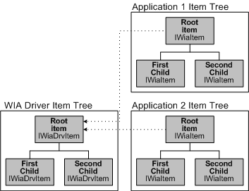

# Application Items and Driver Items

WIA items represent device attributes and device data. Imaging applications see a WIA device as a hierarchical tree of items, with the root item representing the device itself, and any child items representing images or folders that contain images. The tree that an application sees, however, is separate from the tree that is created and maintained by a WIA minidriver. When a minidriver creates a tree of items, the WIA service automatically creates an identical copy of this tree that can be viewed by imaging applications. Items in the copied tree are called *application items*. Items in the tree created by a minidriver are called *driver items*.

More than one imaging application can use a single imaging device at the same time. Each application's view of an item object in a device tree must therefore be independent of another application's view. This is accomplished as follows:

1.  A minidriver creates an item tree of [IWiaDrvItem Interface](https://msdn.microsoft.com/library/windows/hardware/ff543896) objects using the [IWiaMiniDrv Interface](https://msdn.microsoft.com/library/windows/hardware/ff545027) and the [WIA Driver Services Library Functions](https://msdn.microsoft.com/library/windows/hardware/ff551473). The items in this driver item tree are global objects that the minidriver uses to represent the device's items.

2.  When an imaging application requests access to an item in the tree, the WIA service returns an item object that is a copy of the driver item. When an application acquires an application **IWiaItem** (described in the Microsoft Windows SDK documentation) item object (an application item), the WIA service links this object to the minidriver's corresponding **IWiaDrvItem** object in the *driver item tree*.

3.  WIA creates a separate *application item tree* for each application, each application item tree is a copy of the driver item tree.

Applications typically use the **IWiaItem** object to read, validate, and write item properties and to request item data.

The following diagram shows the relationship of application items to driver items.

As the diagram illustrates, each imaging application has its own separate copy of the item tree. The root item in an application item tree contains a pointer back to the root item in the device item tree.

The remainder of this section contains the following topics:

[About Item Properties](about-item-properties.md)

[WIA Driver Item Tree](wia-driver-item-tree.md)

[WIA Camera Tree](wia-camera-tree.md)

[WIA Scanner Tree](wia-scanner-tree.md)

[Common, Camera, and Scanner Properties](common--camera--and-scanner-properties.md)

 

 

