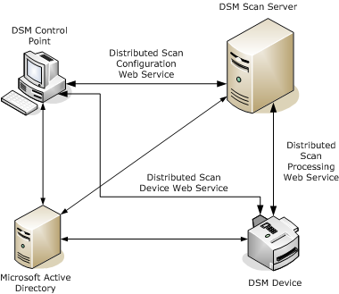

# Architecture

The following figure shows an overview of the DSM Scan Management architecture.

In addition to the Active Directory server, the preceding figure shows the following components:

-   The DSM Device is a network-connected standalone scanner device, or the scanner function in a network-connected copier or multifunction printer.

-   The DSM Control Point is a desktop computer from which an IT administrator runs the Windows scan-management console (SMC) to manage the scanning activities in the organization.

-   The DSM Scan Server processes and stores image data acquired from the DSM device.

The communication paths shown between components are network connections.

### **DISTRIBUTED SCAN DEVICE WEB SERVICE**

A scan-management console (SMC) running on a control point uses the Distributed Scan Device Web Service (WS-DSD) protocol to communicate with a DSM device. This protocol uses a subset of the XML schema elements defined in the WS Scan Service Version 1.0 specification. For more information about this schema, see [Web Services on Devices Scan Service Schema](https://msdn.microsoft.com/library/windows/hardware/ff547963).

An administrator runs the SMC to discover DSM devices and to create scan processes for those devices. Through the SMC, the administrator retrieves scanner elements, device status, and device configuration information from a device. After the administrator creates a scan ticket for the device, the SMC can ask the device to validate the scan ticket. The SMC stores the completed scan process, including the validated scan ticket, in Active Directory.

For more information about the Distributed Scan Device Web Service protocol, see [Distributed Scan Device Web Service Protocol Summary](distributed-scan-device-web-service-protocol-summary.md).

### Distributed Scan Configuration Web Service (WS-DSC)

A scan-management console (SMC) running on a control point uses the Distributed Scan Configuration Web Service (WS-DSC) protocol to communicate with a DSM scan server.

For more information, see the description of the WS-DSC schema in the Windows SDK documentation.

**Note** WS-DSC is related to MS-BDSRR (Scan Repository Capabilities and Status Retrieval Protocol Specification (MS-BDSRR). For more information about MS-BDSRR, see the [Scan Repository Capabilities and Status Retrieval Protocol Specification](http://go.microsoft.com/fwlink/p/?linkid=154735).

A DSM device uses the Distributed Scan Processing Web Service protocol to communicate with a DSM scan server. This protocol uses the XML schema described in [Distributed Scan Processing Web Service Schema](https://msdn.microsoft.com/library/windows/hardware/ff541133).

Before a user can initiate a push-scan operation from a DSM device, the device authenticates the user. For example, the device might have an attached badge reader. The device then sends the user's X.509 certificate to Active Directory. Following authorization, the device obtains from Active Directory a list of the scan processes that the user is authorized to use. The device asks the user to select a scan process from this list, and the device downloads the selected scan process from Active Directory.

After the user selects a scan process, the DSM device can use the Distributed Scan Processing Web Service protocol to communicate with the DSM scan server identified in the scan process. The device asks the scan server to create a post-scan processing job--an instance of the selected scan process--and the scan server validates the parameters requested for the job against the scan process description stored in Active Directory. After the device creates the job, the device sends the images that it acquires to the scan server to be processed and stored.

For more information about the Distributed Scan Processing Web Service protocol, see [Distributed Scan Processing Web Service Protocol Summary](distributed-scan-processing-web-service-protocol-summary.md). For more information about X.509 certificates, see [X.509 Certificate Profile](http://go.microsoft.com/fwlink/p/?linkid=70416).

 

 

--------------------
[Send comments about this topic to Microsoft](mailto:wsddocfb@microsoft.com?subject=Documentation%20feedback%20%5Bimage\image%5D:%20Architecture%20%20RELEASE:%20%288/17/2016%29&body=%0A%0APRIVACY%20STATEMENT%0A%0AWe%20use%20your%20feedback%20to%20improve%20the%20documentation.%20We%20don't%20use%20your%20email%20address%20for%20any%20other%20purpose,%20and%20we'll%20remove%20your%20email%20address%20from%20our%20system%20after%20the%20issue%20that%20you're%20reporting%20is%20fixed.%20While%20we're%20working%20to%20fix%20this%20issue,%20we%20might%20send%20you%20an%20email%20message%20to%20ask%20for%20more%20info.%20Later,%20we%20might%20also%20send%20you%20an%20email%20message%20to%20let%20you%20know%20that%20we've%20addressed%20your%20feedback.%0A%0AFor%20more%20info%20about%20Microsoft's%20privacy%20policy,%20see%20http://privacy.microsoft.com/default.aspx. "Send comments about this topic to Microsoft")

