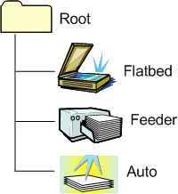

# Auto Item

To implement [auto-configured scanning](auto-configured-scanning.md) in Windows 7 and later, a WIA minidriver must include an *auto item* in the [WIA item tree](wia-item-trees.md) for the scanner device. An auto item belongs to the WIA\_CATEGORY\_AUTO category. For more information about this category, see [WIA Item Categories](wia-item-categories.md).

The following diagram shows an example WIA item tree that includes an auto item. The auto item is a child of the root item in the tree.

In addition to the auto item, the WIA tree in the preceding diagram includes a flatbed item and a feeder item, both of which are children of the root item. The WIA architecture requires that an auto item is never the sole child of the root item--an auto item always has one or more siblings. At least one of these siblings must be a flatbed item, feeder item, or film item. For more information about these items, see [WIA Item Categories](wia-item-categories.md).

If a WIA scanner device supports auto-configured scanning, a WIA application can acquire an image from the currently selected input source on the device by requesting a data transfer from the auto item. In response to this request, the device can automatically configure most of its scan settings before acquiring the image. The application is responsible only for determining the file format to use for the transfer. For this reason, an auto item implements a relatively small subset of the WIA properties that are implemented by the WIA item for a fully programmable input source (that is, a flatbed item, feeder item, or film item). For more information, see [WIA Properties Supported by an Auto Item](wia-properties-supported-by-an-auto-item.md).

The WIA architecture does not permit a scanner device operating in auto-configured scanning mode to automatically select the file format that it uses to transfer image data acquired from an input source. Instead, the application determines the file format--either by explicitly selecting a format or by simply accepting the default format. This restriction prevents the device from transferring scanned image data in a format that the application cannot use.

A WIA minidriver for a scanner device that supports auto-configured scanning should set the AUTO\_SOURCE flag bit in the [**WIA\_DPS\_DOCUMENT\_HANDLING\_CAPABILITIES**](https://msdn.microsoft.com/library/windows/hardware/ff551379) property value implemented by the root item in the WIA tree. A WIA application can query this property to determine whether the WIA item tree for the device contains an auto item.

 

 

