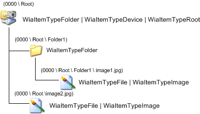

# Creating a WIA Camera Item Tree Layout

A WIA camera item tree for Microsoft Windows Me and Windows XP consists of a root item, and child items that represent images and folders stored on the camera device. See [Initializing the WIA Minidriver](initializing-the-wia-minidriver.md) for an example on how to create an item tree. The following illustration shows the item tree for Windows Me and Windows XP.

For a diagram of a camera tree in Windows Vista and later operating systems, see [Example Usage of WIA Item Flags and Categories](example-usage-of-wia-item-flags-and-categories.md).

The root item of a camera item tree contains all the standard WIA minidriver information and camera-specific properties. The camera-specific properties include the number of pictures taken and other camera control properties.

The child items of a camera item tree represent the images or folders stored on the device. It is recommended that the minidriver eliminate any unnecessary levels of folders to allow easier access to transferable items. This makes access to the WIA items by the application easier and prevents the user from having to navigate deep into a folder structure to get to the actual images.

The minidriver writer can give files and folder items whatever names he or she desires. However, each item in the WIA item tree represents a physical data item on the camera, and should be given a name that suggests the actual data items in the camera.

When a data item is added to or deleted from the camera, it is the responsibility of the WIA minidriver to synchronize its WIA item tree with the contents of the camera. For an example of how this is done, see [Changing the WIA Item Tree Structure](changing-the-wia-item-tree-structure.md).

Through the WIA service, an application can perform the following actions:

-   Query camera capabilities.

-   Set camera device properties.

-   Request a data transfer.

 

 

