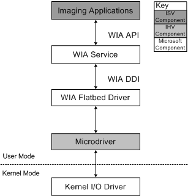

# Creating a WIA Microdriver

Many flatbed scanners are controlled in a similar manner. The common behavior between models has been abstracted into a Microsoft-provided common driver called the WIA Flatbed Driver. This driver calls a DLL, called a microdriver, provided by the scanner vendor, that implements any needed device-specific behavior. The WIA Flatbed Driver together with the microdriver can then be used as a WIA minidriver. The advantage of using a microdriver is that it is very easy to implement and debug. Not all scanners can be supported by a microdriver. It is most appropriate for simple devices (without a duplexer or other advanced features), or when a base-functionality driver is desired.

**Note**  The WIA microdrivers described in this section are WIA 1.0. Currently there is no corresponding WIA microdriver model for WIA 2.0. If you develop a WIA microdriver to run on a computer that has a Windows version that supports WIA 2.0 (Windows Vista or newer), this WIA microdriver will work like any other WIA 1.0 device, and will be used by WIA 2.0 applications in WIA 1.0 compatibility mode.

 

The following diagram shows the components in the WIA microdriver architecture.

The WIA Flatbed Driver handles requests from the WIA service by calling the WIA microdriver functions in the microdriver. The microdriver must implement each of these functions. A [**SCANINFO**](https://msdn.microsoft.com/library/windows/hardware/ff547361) structure is passed to the microdriver to store and communicate scanning parameters such as the scan window and resolution. The WIA Flatbed Driver reads values from the SCANINFO structure, but never writes them. It is the microdriver's responsibility to set the SCANINFO members.

The microdriver should not store any parameters for a scan, but should rely on the values stored in the [**SCANINFO**](https://msdn.microsoft.com/library/windows/hardware/ff547361) structure. This is important for supporting multiple application access to the device. If two applications are setting up a scan on the same device at the same time, there is only one copy of the microdriver running. In this situation the microdriver is called with one of two different SCANINFO structures depending on which application is trying to access the device.

 

 

