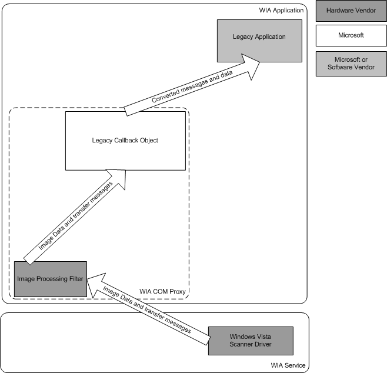

# Data Transfer Between Windows Vista Application and Legacy Driver

The compatibility layer makes it possible for a Windows Vista application to call **IWiaTransfer::Download** (described in the Microsoft Windows SDK documentation) on a legacy driver. The compatibility layer has to implement folder-transfer code as well as format conversions. The compatibility layer implements special code for feeder transfers to ensure that it is always possible to transfer multiple pages from a legacy driver. A Windows Vista application should always be able to request multiple pages during a scan from the feeder item, even with a TYMED\_FILE transfer. The following diagram illustrates a legacy driver with a Windows Vista application.

The legacy callback object within the WIA service converts legacy transfer messages and data into Windows Vista transfer messages and writes data into provided stream.

A Windows Vista application only expects TYMED\_FILE and TYMED\_MULTIPAGE\_FILE so the compatibility layer is responsible for ensuring that TYMED\_CALLBACK and TYMED\_MULTIPAGE\_CALLBACK are not exposed to a Windows Vista application from a legacy driver.

The simplest way to implement this part of the compatibility layer have been to always call into the legacy driver with TYMED\_FILE and TYMED\_MULTIPAGE\_FILE set. The drawback of doing this is that the driver would have always had to scan the entire image, before data could be written back into the application's stream. Therefore, the compatibility layer uses TYMED\_CALLBACK when a Windows Vista application requests a scan of format **WiaImgFmt\_BMP** (the [**WIA\_IPA\_FORMAT**](https://msdn.microsoft.com/library/windows/hardware/ff551553) property set to **WiaImgFmt\_BMP)**. This makes it possible for the compatibility layer to write the data back band by band.

However, a legacy driver does not support **WiaImgFmt\_BMP**, but **WiaImgFmt\_MEMORYBMP** for TYMED\_CALLBACK. Therefore, the conversion callback object has to create the BMP file header and write this file header back to the application as well. Sometimes this is easy, such as when the BMP file header can be directly constructed from the BMP info header. There are cases however when the height of the BMP info header is set to 0. In this case, the WIA compatibility layer must wait until all the data has been transferred before it can write the BMP file header and update the BMP info header.

The reason TYMED transfers, other than just TYMED\_CALLBACK, are preformed from a legacy driver is that multi-page formats are typically only supported by TYMED\_MULTIPAGE\_FILE, and drivers typically support more formats for TYMED\_FILE than for TYMED\_CALLBACK..

During a TYMED\_FILE transfer the compatibility layer waits until the transfer is finished before it writes the data back to the application's stream. This is done by mapping the file to memory and writing all the data in the memory back in one single write request.

During a TYMED\_CALLBACK transfer, the compatibility layer writes back to the application's stream each time it receives an IT\_MSG\_DATA transfer message from the legacy driver.

The compatibility layer also contains a special code for FEEDER transfers. This code ensures that the compatibility layer can transfer multiple pages from the ADF even though the TYMED is not TYMED\_MULTIPAGE\_FILE. The way this is done is by having the compatibility layer call into the driver multiple times, each time requesting only one page. This solution ensures that every legacy driver will be able to handle transfers of multiple pages from the feeder when invoked by a Windows Vista application.

A legacy driver can send "out-of-band" messages during transfers (for example for previewing). These messages will be ignored as they do not fit into the stream-based transfer model.

For more information on the TYMED constants, please see [Understanding TYMED](understanding-tymed.md).

 

 

