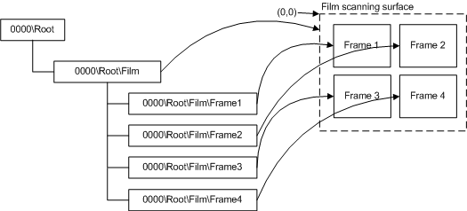
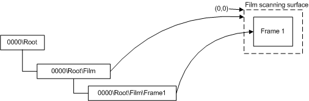

# Dedicated Film Scanners

A *dedicated* film scanner is a scanner that performs only film scanning. This device has only a film scanning surface from which to scan and has the same requirements as a flatbed scanner with film scanning capabilities. That is, the film scanner item must exist and must contain the physical dimensions of the scanning area. This area can be a single scanning frame for film-feeder scanners or a template area.

The following figure illustrates the WIA item tree of a dedicated film scanner with a multiframe scan and shows the physical device and documents.

In the preceding figure, the tree on the left represents the scanner item tree. The curved lines that are drawn to the elements on the right symbolize the physical device and documents that are represented by this item tree.

The following figure illustrates the WIA item tree of a dedicated film scanner with a single frame scan and shows the physical device and documents.

In the preceding figure, the tree on the left represents the scanner item tree. The curved lines that are drawn to the elements on the right symbolize the physical device and documents that are represented by this item tree.

It is important to note that the film item must be able to return a representation of the film scanning surface. Applications that are written for Microsoft Windows XP or Windows Me that have no knowledge of film scanning should still be able to scan by using a dedicated film scanner.

 

 

