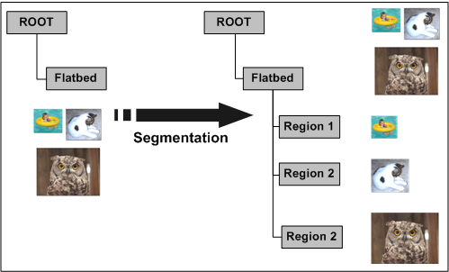

# Driver Behavior During Multipage Transfers

Drivers do not have to support folder acquisition directly. If drivers do not support it, the WIA service will recursively walk the item tree and call [**IWiaMiniDrv::drvAcquireItemData**](https://msdn.microsoft.com/library/windows/hardware/ff543956) on all items that have the **WiaItemTypeTransfer** bit set in the [**WIA\_IPA\_ITEM\_FLAGS**](https://msdn.microsoft.com/library/windows/hardware/ff551585) property.

Drivers that support folder acquisition directly must expose the [**WIA\_IPS\_TRANSFER\_CAPABILITIES**](https://msdn.microsoft.com/library/windows/hardware/ff552657) property on the folder item. This property is a flag property and should have the WIA\_TRANSFER\_ACQUIRE\_CHILDREN\_CAPABLE bit set to indicate that it directly supports folder acquisition functionality. This support means that the driver itself will walk the tree to transfer the relevant items and the WIA service will simply call **IWiaMiniDrv::drvAcquireItemData** on the folder. The driver can differentiate between a normal transfer request and a folder acquisition request by testing the *lFlags* parameter for the WIA\_TRANSFER\_ACQUIRE\_CHILDREN bit.

One of the main reasons that a driver would support folder acquisition directly is efficiency. A driver might transfer multiple items far more efficiently than having the WIA service call a transfer on each of the items.

A good example of this situation is during a multiregion scan. When multiple regions (such as separate pictures) are detected on the flatbed of a scanner, they could be represented as children off the "Flatbed" item. An example of this situation is represented in the following figure.

If a separate transfer was called on each of the child items of "Flatbed", the driver would perform three separate scans, which could be time consuming. However, if a folder acquisition was requested on "Flatbed", the driver would perform one scan, decompose it, and hand back three separate regions (which is often faster).

**Note**  We recommend that only more sophisticated drivers directly support folder acquisition, because the driver is responsible for walking the item tree and taking the appropriate action.

 

 

 

