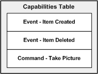

# Driver Capabilities

All WIA minidrivers must define the device's ability to handle notification events and commands. This section describes these minidriver capabilities.

The WIA minidriver is responsible for building a table that lists all of the events and commands that it supports. The following diagram illustrates the capabilities table that the WIA minidriver builds.

The capabilities table is defined as an array of [**WIA\_DEV\_CAP\_DRV**](https://msdn.microsoft.com/library/windows/hardware/ff550233) structures. The minidriver must construct this array and return it to the WIA service when the WIA service calls the [**IWiaMiniDrv::drvGetCapabilities**](https://msdn.microsoft.com/library/windows/hardware/ff543977) method.

### Defining Supported Events and Commands

WIA minidrivers must describe the events and commands that the device supports to the WIA service.

### Events

An *event* is an action at the device level that must be reported to the driver. For example, a scanner might have a front panel button that is labeled "Scan". When users press this button, they expect the scanner to begin scanning, or at the very least, that an application will start to initiate the scan.

WIA supports two types of events:

Action Event  
An *action event* starts the application that is registered to handle such an event. For example, the Microsoft Scanner and Camera Wizard is a registered handler for the Scan event (other applications can register for this event as well). When a driver sends the Scan event, the WIA service starts the Scanner and Camera Wizard to handle this event. This type of event is frequently referred to as a *persistent event*.

Notification Event  
A *notification event* is sent only to applications that are already running and have indicated to the WIA service that they should receive this event. If the application is not running, it is not started to handle this event.

An event can be both an action event and a notification event.

### Commands

A WIA device command is a request that the WIA service sends (on behalf of the imaging application) to the WIA minidriver that instructs the minidriver to perform some action. For example, a WIA camera minidriver might handle the **Take Picture** command. This command instructs the minidriver to order the digital camera device to take a new picture.

**Note**   The Scanner and Camera Wizard responds immediately to the user, even if it still has clean-up to do in the background. For example, the Scanner and Camera Wizard window closes immediately when the user requests to cancel an action; however, the Scanner and Camera Wizard has a separate acquisition thread that continues to run after the window is closed. This separate thread enables an immediate response to the user's request but enables necessary tasks and tasks that cannot be interrupted to complete without impacting the user experience.

 

 

 

