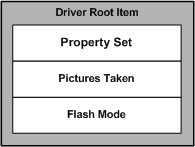
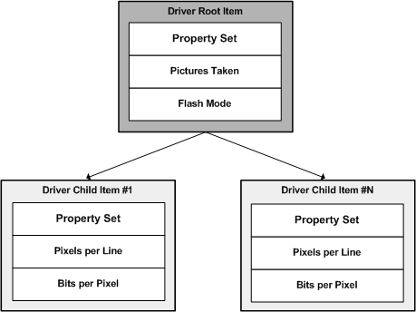
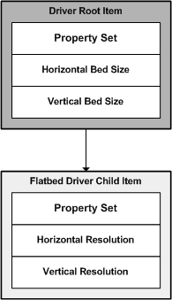

# Driver Items

## 

Properties are stored in WIA driver items. A driver item is a logical description of the still image device and the data that the device stores or produces. A WIA minidriver creates a WIA driver item, by using the functions from the WIA service library.

A WIA driver typically has more than one driver item. The first driver item, which is required, is a logical representation of the still image device and is called the *root item*. The root item contains those properties that describe the characteristics and settings of the physical still image device.

The following diagram is an example of a root item.

A still image device must also describe the data that the device stores or produces. For example, a camera can store many images (or other media formats) on its media. Each image can have information such as a unique name and the dimensions of the image. The WIA minidriver model allows the driver to store the information in *child items*. A child item contains the properties that describe the characteristics of the data that it represents.

The following diagram shows an example of a child item.

Similar to the directory hierarchy found in modern file systems that consist of directories and files, the WIA minidriver model stores root and child items in a hierarchy that is referred to as an *item tree*. A WIA minidriver uses the WIA services library to create root and child driver items that logically describe the device and its data. For digital still camera devices, or any still image device that stores more than one image, the item tree resembles a directory structure with one root item and many child items.

The following diagram is an example of an item tree that a minidriver creates for a digital still camera.

For a simple flatbed scanner device, or any still image device that does not have storage, the item tree contains only one child item. We recommend that the child item be named in a way that specifically identifies the device. For example, a flatbed scanner acquires its data from the scanner bed; therefore, the child item should be named "Flatbed."

The following diagram illustrates an item tree that a minidriver creates for a simple flatbed scanner.

For more information about driver items, see [Developing a WIA Driver: Basic Concepts](developing-a-wia-driver--basic-concepts.md), [Developing a WIA Scanner Driver](developing-a-wia-scanner-driver.md) and [Developing a WIA Camera Driver](developing-a-wia-camera-driver.md).

 

 

--------------------
[Send comments about this topic to Microsoft](mailto:wsddocfb@microsoft.com?subject=Documentation%20feedback%20%5Bimage\image%5D:%20Driver%20Items%20%20RELEASE:%20%288/17/2016%29&body=%0A%0APRIVACY%20STATEMENT%0A%0AWe%20use%20your%20feedback%20to%20improve%20the%20documentation.%20We%20don't%20use%20your%20email%20address%20for%20any%20other%20purpose,%20and%20we'll%20remove%20your%20email%20address%20from%20our%20system%20after%20the%20issue%20that%20you're%20reporting%20is%20fixed.%20While%20we're%20working%20to%20fix%20this%20issue,%20we%20might%20send%20you%20an%20email%20message%20to%20ask%20for%20more%20info.%20Later,%20we%20might%20also%20send%20you%20an%20email%20message%20to%20let%20you%20know%20that%20we've%20addressed%20your%20feedback.%0A%0AFor%20more%20info%20about%20Microsoft's%20privacy%20policy,%20see%20http://privacy.microsoft.com/default.aspx. "Send comments about this topic to Microsoft")

