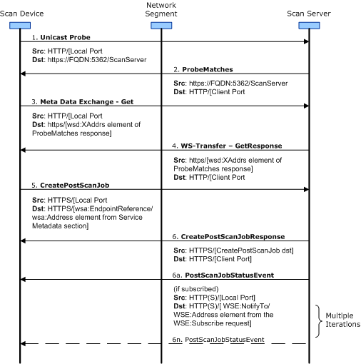
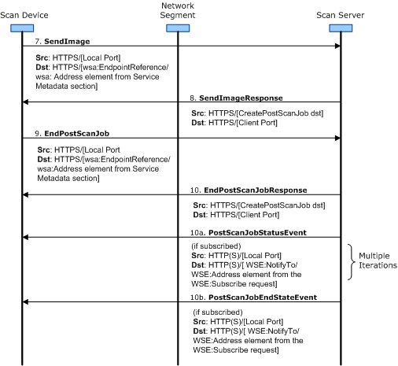

# DSM Scan Job Sequence Diagram

When you scan a document on a scan device that is part of a distributed scan management (DSM) system, the scan device retrieves the scan processes that are associated with you, the user, and displays them to you. You use the DSM scan device user interface to select the appropriate settings, and then scan the document.

The DSM scan device uses the settings that are specified in the scan ticket of the selected process to scan the document. The following process and diagram explain how the DSM scan device communicates with the scan server after the document is scanned.

1.  Because the fully qualified name of the DSM scan server is included in the settings for the scan process, the DSM scan device uses a unicast probe to initiate direct communication with the DSM scan server.

2.  The DSM scan server sends a **ProbeMatches** packet to the DSM scan device. This packet contains the address of the web service device host.

3.  The DSM scan device sends a **Meta Data Exchange - Get** request to the address specified in the **ProbeMatches** packet received from the DSM scan server in step 2. This **Get** request serves as a metadata exchange with the DSM scan server, to find the endpoint address of the distributed scan processing web service. For example, the **Get** request might be sent to *https://FQDN:5362/ScanServer,* which is the address specified by the scan server in step 2. This process is shown in the diagram that follows step 6.

4.  The DSM scan server responds with **WS-TransferGetResponse**, which contains the service metadata for each of the services that the DSM scan server supports.

5.  The DSM scan device submits a **CreatePostScanJob** operation to the scan server to process of the images after they have been scanned. The **CreatePostScanJob** operation contains the instructions that the scan server uses to process the scanned image. An example of the destination address for the post-scan instructions might be *https://FQDN:5362/ScanServer/978e9349-e854-444f-87a6-1946553e14a6.*

6.  The DSM scan server responds with **CreatePostScanJobResponse**.
    -   6a. If the DSM scan device subscribed to receive post-scan job status events, the DSM scan server sends **PostScanJobStatusEvent** messages to the scan device when the post-scan job is created. Additionally, the DSM scan server sends these messages each time the state of the overall job changes.
    -   6n. The DSM scan server sends a **PostScanJobStatusEvent** message *n* number of times, depending on the number of post-scan jobs that are created, the number of times the overall job changes, or both.

    
7.  When the **PostScanJobStatusEvent** iterations have completed, the DSM scan device submits the image data of each scanned document to the DSM scan server in a **SendImage** operation. For example, the destination address of the messages that are related to the **SendImage** process might be *https://FQDN:5362/ScanServer/978e9349-e854-444f-87a6-1946553e14a6*. This is shown as step 7 in the diagram that follows step 10.

8.  The DSM scan server responds by sending a **SendImageResponse** message.

9.  The DSM scan device sends an **EndPostScanJob** operation after it sends the last **SendImage** operation. The scan device uses the address element from the distributed scan processing service metadata as the destination address for the **EndPostScanJob** operation. For example, the destination address might be *https://FQDN:5362/ScanServer/978e9349-e854-444f-87a6-1946553e14a6*.

10. The DSM scan server responds by sending a **EndPostScanJobResponse** message.
    -   10a. If the DSM scan device sets up a subscription to receive post-scan job status events, after the DSM scan server responds with the **EndPostScanJobResponse** operation, the DSM scan server sends a number of **PostScanJobStatusEvent** messages to the DSM scan device. The number of **PostScanJobStatusEvent** messages sent to the DSM scan device depends on the number of scan process filters that must be processed for the post-scan jobs.
    -   10b. If the DSM scan device sets up a subscription to receive post-scan end state events, after the DSM scan server completes the post-scan job it sends a **PostScanJobEndStateEvent** message to the DSM scan device.

    

 

 

--------------------
[Send comments about this topic to Microsoft](mailto:wsddocfb@microsoft.com?subject=Documentation%20feedback%20%5Bimage\image%5D:%20DSM%20Scan%20Job%20Sequence%20Diagram%20%20RELEASE:%20%288/17/2016%29&body=%0A%0APRIVACY%20STATEMENT%0A%0AWe%20use%20your%20feedback%20to%20improve%20the%20documentation.%20We%20don't%20use%20your%20email%20address%20for%20any%20other%20purpose,%20and%20we'll%20remove%20your%20email%20address%20from%20our%20system%20after%20the%20issue%20that%20you're%20reporting%20is%20fixed.%20While%20we're%20working%20to%20fix%20this%20issue,%20we%20might%20send%20you%20an%20email%20message%20to%20ask%20for%20more%20info.%20Later,%20we%20might%20also%20send%20you%20an%20email%20message%20to%20let%20you%20know%20that%20we've%20addressed%20your%20feedback.%0A%0AFor%20more%20info%20about%20Microsoft's%20privacy%20policy,%20see%20http://privacy.microsoft.com/default.aspx. "Send comments about this topic to Microsoft")

