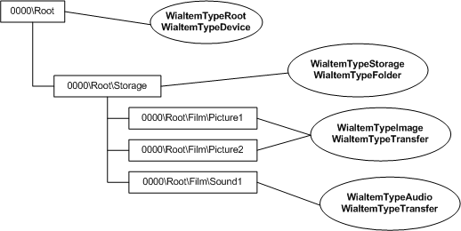
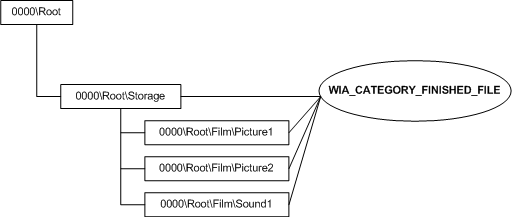
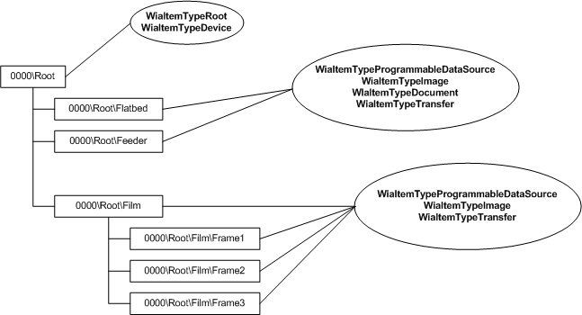
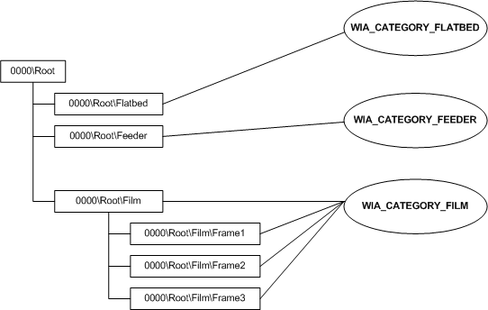

# Example Usage of WIA Item Flags and Categories


This topic applies to Windows Vista and later.

This section depicts scanner and camera item trees in Windows Vista, along with the WIA item flags and WIA categories. The diagrams depict what a camera item tree and a scanner item tree would look like in Windows Vista and later. There are two diagrams for both the camera item tree and the scanner item tree. In both cases, the first diagram illustrates which WIA items flags are needed, while the second diagram illustrates which WIA categories are used. The code example is an example of what an application would do to use the combination of the flags and categories.

The following figure shows a camera item tree and the flags in the WIA\_ITEM\_FLAGS property that must be set.



In the preceding figure, the tree on the left represents the camera item tree. The balloons on the right contain the WIA item flags that such a device would need to use.

The following diagram shows a camera item tree and the category in the WIA\_IPA\_ITEM\_CATEGORY property that must be set.



In the preceding figure, the tree on the left represents the camera item tree. The balloon on the right contains the category that such a device would need to use.

The following diagram shows the item tree for a scanner with a document feeder and a film scanner, and the flags in the WIA\_ITEM\_FLAGS property that must be set.



In the preceding figure, the tree on the left represents the scanner item tree. The balloons on the right contain the WIA item flags that such a device would need to use.

The following figure shows the item tree for a scanner, and the categories in the WIA\_IPA\_ITEM\_CATEGORY property that must be set.



In the preceding figure, the tree on the left represents the scanner item tree. The balloons on the right contain the categories in the WIA\_IPA\_ITEM\_CATEGORY property that such a device must set.

For a complete list of all categories defined by WIA and information about valid WIA item flags for each category, see [**WIA\_IPA\_ITEM\_CATEGORY**](https://msdn.microsoft.com/library/windows/hardware/ff551581).

For a complete list of all WIA item flags see [**WIA\_IPA\_ITEM\_FLAGS**](https://msdn.microsoft.com/library/windows/hardware/ff551585).

The following code example demonstrates how an application could use the combination of the WIA\_IPA\_ITEM\_FLAGS and WIA\_IPA\_ITEM\_CATEGORY properties for classifying a WIA item found in the WIA item tree.

```cpp
HRESULT hr = S_OK;
PROPSPEC ps[2] = {{PRSPEC_PROPID,WIA_IPA_ITEM_FLAGS},
                  {PRSPEC_PROPID, WIA_IPA_ITEM_CATEGORY}};
PROPVARIANT pv[2] = {0};

hr = pIWiaPropertyStorage->ReadMultiple(2, ps, pv);
if (hr == S_OK)
{
    if (pv[0].lVal & WiaItemTypeProgrammableDataSource)
    {
        // Item is a programmable data source.
    }
    else
    {
        // Item is NOT a programmable data source and there must be
        // some data associated with the device, or a folder.
        // Use the WIA item flags to further classify the item.

        if (pv[0].lVal & WiaItemTypeImage)
        {
            // Item represents image data.
        }
        if (pv[0].lVal & WiaItemTypeAudio)
        {
            // Item represents audio data.
        }
        if (pv[0].lVal & WiaItemTypeVideo)
        {
            // Item represents video data.
        }
        if (pv[0].lVal & WiaItemTypeDocument)
        {
            // Item represents document data.
        }
    }

    // Read the category to properly use the item.
    switch(pv[1].lVal)
    {
        case WIA_CATEGORY_FINISHED_FILE:
            // Item is a finished file item.
  break;
        case WIA_CATEGORY_FLATBED:
            // Item is a flatbed scanner item.
   break;
        case WIA_CATEGORY_FILM:
            // Item is a film scanning item.
  break;
        case WIA_CATEGORY_FEEDER:
            // Item is a document feeder scanner item.
   break;
        default:
            // Item is not a WIA-defined item (possibly vendor specific?).
   break;
    }
    ...
}
...
```

 

 


