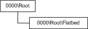
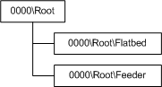

# Flatbed Scanner Architecture

If a scanner device supports flatbed platen scanning, it should implement a flatbed scanner item as the first child item, directly off of the root item in its WIA item tree; also, the [**WIA\_IPA\_ITEM\_CATEGORY**](https://msdn.microsoft.com/library/windows/hardware/ff551581) property must be set to WIA\_CATEGORY\_FLATBED. This flatbed item represents a programmable data source and produces an image from the document that is currently placed on the scanner's flatbed platen when a data transfer is requested from this item.

A scanner that supports only flatbed platen scanning has the WIA item tree that the following figure shows.

Notice that the WIA flatbed item is located directly off of the root item.

A scanner that supports flatbed platen scanning and document feeder scanning has the WIA item tree that the following figure shows.

The first nonroot item in the WIA item tree must be the WIA flatbed item, if other scanning data sources are implemented. This arrangement makes it easier to support Microsoft Windows XP and Windows Me applications. For more information about compatibility with these operating systems, see [WIA Flatbed Scanner Compatibility for Windows Me and Windows XP](wia-flatbed-scanner-compatibility-for-windows-xp-and-windows-me.md).

 

 

