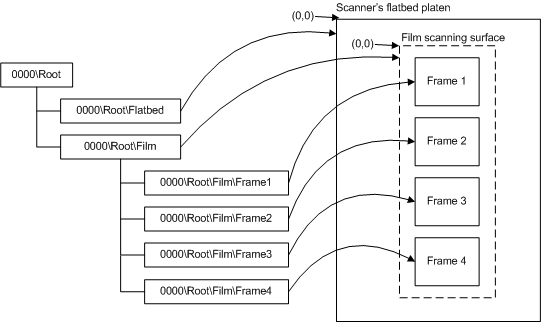

# Flatbed Scanners that Support Film Scanning

The following figure illustrates a possible WIA item tree of a flatbed scanner that supports film scanning by using the flatbed platen as the film scanning surface. The figure also illustrates the physical device and documents.

In the preceding figure, the tree on the left represents the scanner item tree. The curved lines that are drawn to the elements on the right symbolize the physical device and documents that are represented by this item tree.

The film scanner item always represents the entire film scanning surface. The valid values for the extent settings should be restricted to the entire scanning surface so that preview scans always present a single image that represents the entire film scanning area. This single image is useful for applications that show the user a representation of the slides or film that are placed on the scanning surface. The extent settings for the individual frame items are limited to the physical dimensions of the film scanning surface. The bed size properties on the film item [**WIA\_DPS\_HORIZONTAL\_BED\_SIZE**](https://msdn.microsoft.com/library/windows/hardware/ff551399) and [**WIA\_DPS\_VERTICAL\_BED\_SIZE**](https://msdn.microsoft.com/library/windows/hardware/ff551445) should represent the physical dimensions of the film scanning area. Notice that the extent settings of the film scanning surface start at (0,0) even though it is located in the middle of the flatbed scanning platen. This numbering is because the film scanning surface has its own origin, independent of the flatbed scanning origin.

**Note**   Overlapping frame selection areas are allowed in a film scanning session.

 

 

 

