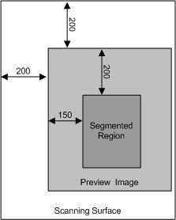

# Implementation Notes for Segmentation Filters

It is important to note the properties that the segmentation filter sets into each child item it creates. These properties are: [**WIA\_IPS\_XPOS**](https://msdn.microsoft.com/library/windows/hardware/ff552663), [**WIA\_IPS\_YPOS**](https://msdn.microsoft.com/library/windows/hardware/ff552671), [**WIA\_IPS\_XEXTENT**](https://msdn.microsoft.com/library/windows/hardware/ff552661), WIA\_IPS\_YEXTENT, and possibly [**WIA\_IPS\_DESKEW\_X**](https://msdn.microsoft.com/library/windows/hardware/ff552581) and [**WIA\_IPS\_DESKEW\_Y**](https://msdn.microsoft.com/library/windows/hardware/ff552587). These property values correspond to the item's position on the flatbed, not in the image passed into the *pInputStream* parameter.

Thus, it is important for the segmentation filter to pay close attention to the WIA\_IPS\_XPOS, WIA\_IPS\_YPOS, and [**WIA\_IPS\_ROTATION**](https://msdn.microsoft.com/library/windows/hardware/ff552648) properties of the passed-in image.

As an example, assume that an application does a preview scan where it sets WIA\_IPS\_XPOS = WIA\_IPS\_YPOS = 200 into the (parent) item before acquiring the preview image. It then calls into the segmentation filter to detect possible subregions. However, the actual algorithm used in the segmentation filter acts on the image that is passed into it. If this algorithm detects a sub-region corner 150 pixels to the right of the image's left edge and 200 pixels down from the top of the image, this actually corresponds to a point located at (350, 400) on the scanner.

In the following figure, the outer region represents the scanner flatbed. Although the algorithm will find the coordinates of the upper-left corner of the region to be (150, 200), the values that segmentation filter should set into the child item for WIA\_IPS\_XPOS and WIA\_IPS\_YPOS are 350 and 400.

If for example, an application will display the regions detected by the segmentation filter visually, it must be aware that the segmentation filter sets the coordinates corresponding to their position in the flatbed. This means that the application must map the flatbed coordinates to the coordinates in the preview image. In most cases, however, an application will perform a preview scan with WIA\_IPS\_XPOS = WIA\_IPS\_YPOS = 0 and no rotation ([**WIA\_IPS\_ROTATION**](https://msdn.microsoft.com/library/windows/hardware/ff552648) = PORTRAIT). If this is the case, there is a direct mapping between the coordinates on the flatbed and those in the preview image.

Another property that the segmentation filter must pay attention to is the rotation property, WIA\_IPS\_ROTATION, providing the driver implements this property. Assume for example that when acquiring the preview image, the application set WIA\_IPS\_ROTATION to ROT180. In this case the upper-left corner of the image passed into the segmentation filter actually corresponds to the lower- right corner on the flatbed. Therefore, the segmentation filter must map the coordinates of each subregion it detects in the rotated image to what their coordinates on the flatbed should be. Once the segmentation filter has performed this mapping, it can set WIA\_IPS\_XPOS, WIA\_IPS\_YPOS, and other property values into the child item corresponding to the subimage.

Note that, in most cases, WIA\_IPS\_XPOS and WIA\_IPS\_YPOS will be set to zero, and WIA\_IPS\_ROTATION will be set to PORTRAIT. However, the segmentation should be able to handle a case in which they are not set to these values.

Also note that while an application can pass in an image to the segmentation filter that has been rotated by the driver, it must not pass in an image on which deskewing has already been performed.

 

 

