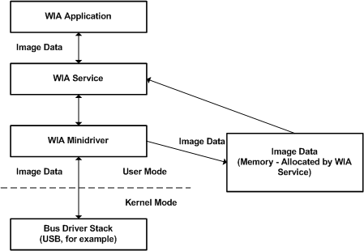

# In-Memory Transfers

**Note**  In-memory transfers are for operating systems prior to Windows Vista.

 

An *in-memory data transfer* is a transfer of imaging data from the WIA minidriver into a memory buffer that the WIA service has allocated. The WIA application that initiates the data transfer always determines the size of the data transfer buffer. The size of this data transfer buffer cannot be less than the value that the minidriver defines in the [**WIA\_IPA\_BUFFER\_SIZE**](https://msdn.microsoft.com/library/windows/hardware/ff551527) property.

After the WIA application determines the buffer size, it requests the WIA service to begin the data transfer. The WIA service then allocates the memory buffer of the requested size (according to the constraints that the preceding paragraph mentioned) and requests that the WIA minidriver begin the data transfer and place the data into the supplied buffer. The WIA minidriver fills the buffer with data and returns it to the WIA service, which then returns the data to the requesting WIA application. This process is repeated until there is no more data to transfer.

The following diagram illustrates a memory transfer of an image.

 

 

