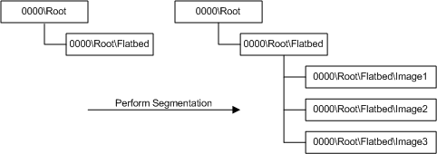

# Interfaces for Segmentation Filters


Beginning with Windows Vista, WIA will support segmentation filters. A segmentation filter must implement the [IWiaSegmentationFilter Interface](https://msdn.microsoft.com/library/windows/hardware/ff545035).

The **IWiaSegmentationFilter** interface is dependent on the new (for Windows Vista) interface **IWiaItem2**, which is used throughout this section, is a superset of **IWiaItem**. In addition to the **IWiaItem** methods, the **IWiaItem2** interface includes the method **IWiaItem2::GetExtension**, which is used by an application to create WIA extensions, including the segmentation filter. The **IWiaItem** and **IWiaItem2** interfaces are described in the Microsoft Windows SDK documentation.

The **IWiaSegmentationFilter** interface implements a single method, **DetectRegions**. This method has three parameters, *lFlags*, *pInputStream*, and *pWiaItem2*.

The *lFlags* parameter is currently unused.

The *pInputStream* parameter is a pointer to the image on which segmentation is to be performed. Typically this is a preview image representing the entire scanning surface of the flatbed. The stream is created by the application in its **IWiaTransferCallback::GetNextStream** method; this method is called during image acquisition. The driver writes the acquired image data into the stream that the **IWiaTransferCallback::GetNextStream** method returns. This is also the stream that should be passed into the segmentation filter by the application. The **IWiaTransferCallback** interface is described in the Windows SDK documentation.

The *pWiaItem2* parameter is a pointer to the WIA item for which *pInputStream* was acquired. It is also referred to as the parent item. For example, the item that *pWiaItem2* points to could be the flatbed item.

The [**IWiaSegmentationFilter::DetectRegions**](https://msdn.microsoft.com/library/windows/hardware/ff545030) method is used to determine the subregions of the image represented by *pInputStream*. For each subregion detected, **IWiaSegmentationFilter::DetectRegions** creates a new child WIA item under the item pointed to by *pWiaItem2*. For each child item, the segmentation filter must set the values for the following WIA properties: [**WIA\_IPS\_XPOS**](https://msdn.microsoft.com/library/windows/hardware/ff552663), [**WIA\_IPS\_YPOS**](https://msdn.microsoft.com/library/windows/hardware/ff552671), [**WIA\_IPS\_XEXTENT**](https://msdn.microsoft.com/library/windows/hardware/ff552661), and [**WIA\_IPS\_YEXTENT**](https://msdn.microsoft.com/library/windows/hardware/ff552669). These properties represent the bounding rectangle of the area to scan. A more advanced segmentation filter may also want to set other WIA properties, such as [WIA Properties for Segmentation Filters](wia-properties-for-segmentation-filters.md) if the driver supports deskewing.

The following diagram shows how the segmentation filter modifies the application item tree. In this diagram, the segmentation filter has detected three images on the flatbed, and, for each image, it has created a new child item under the flatbed item.



A segmentation filter must support all the image formats supported by the driver that it extends. The segmentation filter that Microsoft provides supports BMP, GIF, JPEG, PNG, and TIFF formats. Thus, any driver that uses this filter is limited to these formats.

To create the child items, the segmentation filter calls the **IWiaItem2::CreateChildItem** method. The following is an example of such a call:

```cpp
lItemFlags = WiaItemTypeGenerated | WiaItemTypeTransfer | WiaItemTypeImage | WiaItemTypeFile |
 WiaItemTypeProgrammableDataSource;

lCreationFlags = COPY_PARENT_PROPERTY_VALUES;

pWiaItem2->CreateChildItem(lItemFlags,
                           lCreationFlags,
                           bstrItemName,
                           &pChildItem);
```

**IWiaItem2::CreateChildItem** differs slightly from **IWiaItem::CreateChildItem**. The **IWiaItem2::CreateChildItem** method has a new parameter, *lCreationFlags*; The **IWiaItem2::CreateChildItem** method's *lItemFlags* parameter corresponds to the *lFlags* parameter of **IWiaItem::CreateChildItem**. Passing COPY\_PARENT\_PROPERTY\_VALUES with the *lCreationFlags* parameter to the WIA service, as shown in the preceding code snippet, tells the WIA service to set all readable/writeable WIA properties of the child item to the same values as its parent's. The reason a segmentation filter should pass this flag is to ensure that properties, such as image format and resolution in the newly created child item, are the as the parent item. It is important that the resolution is the same because the extent properties that the segmentation filter will set into the child item are dependent on the resolution of the image. It is also important that the image format and resolution are the same in the child item if an application wants to use the preview component (described in the Microsoft Windows SDK documentation). Before acquiring the final image, an application can modify the resolution to acquire a higher quality image from the scanner.

It is important to note that the segmentation filter is bound by the same restrictions as an application in what it can and cannot do. This means that an application can modify the child items that the segmentation filter creates. For example, a user might not be satisfied with the region that the segmentation filter detected and might tell the application to modify this region by dragging its corners. The application can also delete child items created by the segmentation filter as well as add new ones.

Note that the segmentation filter is not responsible for "cleaning up" the child items that it created. So if the application calls **IWiaSegmentationFilter::DetectRegions** more than once, the application must first delete the child items created in the first call to the **IWiaSegmentationFilter::DetectRegions** method. The segmentation filter is also not responsible for resetting the *pInputStream* parameter. The application must ensure that it has set the seek pointer to the beginning of the stream before calling the segmentation filter.

The segmentation filter should only be used on the film item and on the flatbed item. For film scanning, a scanner often comes with fixed frames, in which case the driver creates the child items (please refer to [WIA Scanner Item Tree Layout](wia-scanner-item-tree-layout.md) for more information). In this case, an application should not invoke the segmentation filter for region detection and creation of child items.

If a driver comes with a segmentation filter, it should implement the [**WIA\_IPS\_SEGMENTATION**](https://msdn.microsoft.com/library/windows/hardware/ff552649) property for its flatbed and film WIA items. This read-only property has two valid values: WIA\_USE\_SEGMENTATION\_FILTER and WIA\_DONT\_USE\_SEGMENTATION\_FILTER, which the driver sets. This property lets an application know if it should use the driver's segmentation filter for region detection on a certain item.

If a scanner uses fixed frames for film scanning, it would set this property to WIA\_DONT\_USE\_SEGMENTATION\_FILTER in the film item. In this case, the application should not try to load the segmentation filter after the film preview has been acquired; instead it should enumerate the child items created by the driver. These child items represent the fixed frames.

Because a WIA item is passed into **IWiaSegmentationFilter::DetectRegions**, it is possible for the segmentation filter to use different algorithms depending on the category of the item, i.e. flatbed or film. An item's category is stored in the [**WIA\_IPA\_ITEM\_CATEGORY**](https://msdn.microsoft.com/library/windows/hardware/ff551581) property.

If an application changes any properties in *pWiaItem2* between acquiring the image in *pInputStream* and the application's call to **IWiaSegmentationFilter::DetectRegions**, the original property settings (i.e. the property settings the item had when the stream was acquired) must be restored. This can be done using the **IWiaPropertyStorage::GetPropertyStream** and **IWiaPropertyStorage::SetPropertyStream** methods. The reason these changes need to be restored is that there may be information in the WIA item that is necessary for the segmentation filter, but that is not stored in the image header. Examples of such information are the data stored in the [**WIA\_IPS\_XPOS**](https://msdn.microsoft.com/library/windows/hardware/ff552663), [**WIA\_IPS\_YPOS**](https://msdn.microsoft.com/library/windows/hardware/ff552671), and [**WIA\_IPS\_ROTATION**](https://msdn.microsoft.com/library/windows/hardware/ff552648) properties. The **IWiaPropertyStorage** interface and its methods are described in the Windows SDK documentation.

An application obtains an instance of the segmentation filter by calling **IWiaItem2::GetExtension** (described in the Windows SDK documentation). An application would typically call this method before displaying its preview window. This is because a driver might not come with a segmentation filter, in which case the UI should know not to display an unsupported button, such as **Perform Segmentation**.

 

 


