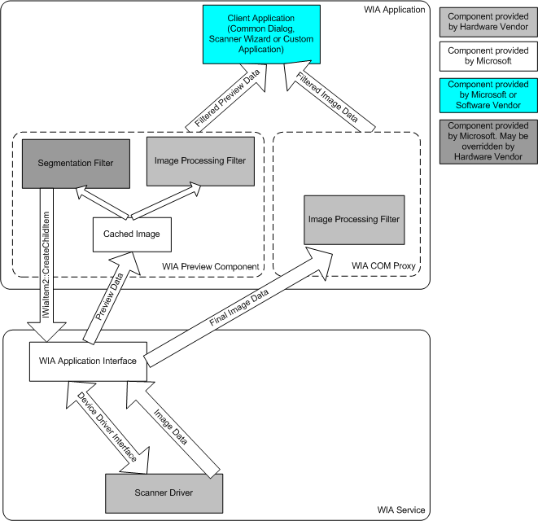

# Introduction to Segmentation Filters

A segmentation filter is a WIA extension that can be used by an application to separate the individual pictures laid out on a flatbed scanner, so each of these pictures can be acquired into individual images. The segmentation filter is an in-process COM component running in the application's process.

A segmentation filter is dependent on the driver that it extends. Driver developers can choose to write their own segmentation filter or use the segmentation filter that Microsoft provides beginning with Windows Vista.

The segmentation filter can only be used by applications that support the [IStream based WIA transfer model](wia-transfer-architecture.md).

The following figure shows the segmentation filter component running in the application's process.

 

 

