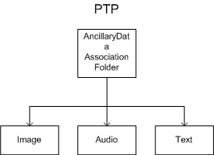
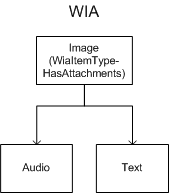

# Mapping PTP Associations to WIA Folders

For most object associations, the PTP driver creates a WIA folder item. The WIA\_IPA\_ITEM\_FLAGS property has different flags set, depending on the association type, as shown in this table:

PTP Association Code
Association Type
WIA Item Type Flags
(described in the Windows SDK documentation)
0x0000

Undefined

WiaItemTypeFolder

0x0001

GenericFolder

WiaItemTypeFolder

0x0002

Album

WiaItemTypeFolder

0x0003

TimeSequence

WiaItemTypeFolder | WiaItemTypeBurst

0x0004

HorizontalPanoramic

WiaItemTypeFolder | WiaItemTypeHPanorama

0x0005

VerticalPanoramic

WiaItemTypeFolder | WiaItemTypeVPanorama

0x0006

2DPanoramic

WiaItemTypeFolder

0x0007

AncillaryData

See accompanying text.

 

The **SequenceNumber** field of the ObjectInfo dataset is put into the WIA\_IPC\_SEQUENCE property. The PTP driver does not currently use the WIA\_IPC\_XCOORDINATE and WIA\_IPC\_YCOORDINATE properties. The **AssociationDesc** member of the ObjectInfo dataset is currently not used.

The following diagram shows an example AncillaryData association as stored on the camera. This association consists of an image together with associated audio and text.

When an AncillaryData association is mapped to a WIA folder, the nonimage objects become children of the image object, as shown in the following diagram. The image object has the WiaItemTypeHasAttachments flag set in WIA\_IPA\_ITEM\_FLAGS.

 

 

