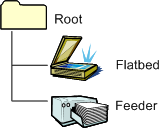
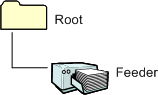

# Non-Duplex-Capable Document Feeder

The following figure illustrates the WIA item tree for a flatbed scanner that supports simple (non-duplex) document feeder scanning.

A scanner with a feeder (or automatic document feeder) does not have to have a flatbed. The following figure illustrates the item tree for a feeder scanner without a flatbed or duplexer.

The flatbed item can be omitted only if no flatbed is present on the scanner. Similarly, the feeder item must be present in the item tree for any scanner that has a feeder. The feeder item is used to control settings such as basic scans (no duplexing or Simplex), simple duplex (identical front and back items), and advanced duplex scans (independent front and back items).

### Scanning

Applications navigate to the feeder item to perform document feeder scans. This item is where applications configure the number of pages to scan and the settings for each page. Notice that scanning three documents results in three pages.

### Image Acquisition

In standard acquisition and folder acquisition, the WIA feeder item property settings are used for all front pages. For more information about standard acquisition and folder acquisition, see [Advanced Duplex-Capable Document Feeder](advanced-duplex-capable-document-feeder.md).

 

 

