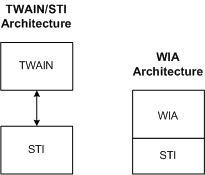

# Overview of Microsoft STI and Microsoft WIA

The imaging architecture in legacy Windows operating systems consisted of a low-level hardware abstraction, STI, and a high-level set of APIs known as TWAIN. In the modern Windows operating systems, Microsoft uses Windows Imaging Architecture (WIA), an imaging architecture that builds on STI. The following diagram illustrates these two imaging architectures.

As shown in the preceding figure, the TWAIN/STI architecture includes TWAIN, a high-level set of image acquisition APIs, together with STI, a low-level hardware abstraction. The WIA architecture incorporates STI as a foundation to provide a complete solution to imaging device IHVs.

### Differences Between STI and WIA

A WIA driver builds on the foundation provided by STI and so exposes STI interfaces in addition to its own. At a minimum, a WIA driver must expose the **IStiUSD** interface. STI has no corresponding dependency on any WIA interface. Because a WIA minidriver must be compliant with an STI minidriver, it is possible to write just an STI minidriver that makes a WIA-capable camera or scanner an STI image device. However, WIA is recommended for a better user experience. For example, an STI driver for a camera does not show thumbnails in Explorer.

Some differences between STI and WIA include the following:

-   STI runs in both the client application process and the system service process; WIA runs in the system service process only.

-   STI, being a low-level hardware abstraction, must have detailed information about the device in order to operate; WIA can operate without such detailed device information.

-   STI is not a complete imaging interface; WIA, which is built on top of STI, is a full solution for imaging IHVs. An IHV-supplied UI module (for example, Twain,) is required in an STI architecture because it has only a device communication mechanism, and does not have a UI front end. A WIA minidriver does not require its own UI module, because there is a default UI (the Scanner and Camera Wizard). Additionally, a Twain interface is supported through the TWAIN compatibility layer in the WIA architecture. IHVs can extend or replace these default UIs in WIA.

For more information about the WIA architecture, see [WIA Architecture Overview](wia-architecture-overview.md).

 

 

