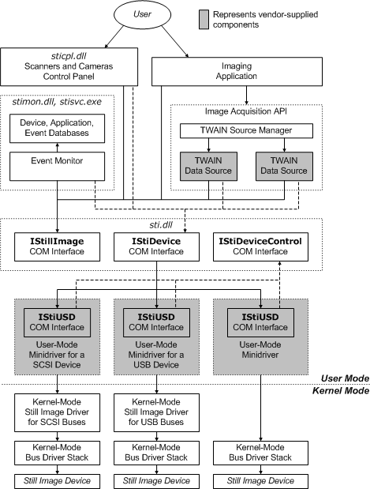

# Overview of STI Components

The following diagram illustrates the software components that compose Microsoft STI. Following the diagram is a component list.

### Imaging Application

Imaging applications typically receive, display, and allow editing of captured still images. They obtain images by calling an image acquisition API, such as TWAIN. They must register themselves with the still image event monitor, through the [IStillImage COM Interface](istillimage-com-interface.md). For more information, see [Creating Push-Model Aware Applications](creating-push-model-aware-applications.md).

### Image Acquisition API

TWAIN, ISIS, and Adobe Systems' Acquire are examples of image acquisition APIs. The diagram illustrates TWAIN. Vendor-supplied TWAIN data sources are device-specific, Operating System-specific components that communicate with still image devices.

Under Microsoft STI, TWAIN data sources call methods supplied by the [IStillImage](istillimage-com-interface.md)and [IStiDevice](istidevice-com-interface.md) interfaces. For more information, see [Creating Device-Specific Components for Image Acquisition APIs](creating-device-specific-components-for-image-acquisition-apis.md).

### Scanners and Cameras Control Panel

The Scanners and Cameras Control Panel enables users to perform the following operations:

-   View a list of installed still image devices.

-   Test still image devices.

-   View and modify information provided by vendor-supplied, device-specific [property sheet pages for still image devices](property-sheet-pages-for-still-image-devices.md).

-   Assign [still image device events](still-image-device-events.md) to specific applications.

### Still Image Event Monitor

The still image event monitor resides in the still image server process. It maintains a database of all still image devices (both Plug and Play−compatible devices and those installed through the Add Hardware Wizard). It also maintains databases of registered applications and still image device events.

The event monitor waits for still image device events. (For devices supported by older drivers that do not generate still image device events, the event monitor creates a polling thread.) When an event is detected, the event monitor starts the application that the user has previously assigned to the event (by means of the Scanners and Cameras Control Panel). If the user has assigned the event to several applications, the event monitor asks the user which application to start. If the event has not been assigned to any application, it is ignored.

For more information about the still image event monitor, see *Still Image* in the Microsoft Windows SDK documentation.

### COM Interfaces for Still Image

Microsoft STI defines a set of COM interfaces that provide communications paths among the various Microsoft STI components. The following COM interfaces are defined:

[IStillImage COM Interface](istillimage-com-interface.md)

[IStiDevice COM Interface](istidevice-com-interface.md)

[IStiUSD COM Interface](istiusd-com-interface.md)

[IStiDeviceControl COM Interface](istidevicecontrol-com-interface.md)

### User-Mode Still Image Minidrivers

User-mode still image minidrivers are vendor-supplied components that provide a device-specific, user-mode interface to an appropriate kernel-mode driver. Each of these user-mode drivers must implement the [IStiUSD COM Interface](istiusd-com-interface.md). They communicate with kernel-mode drivers by calling the [**CreateFile**](https://msdn.microsoft.com/library/windows/desktop/aa363858), **ReadFile**, **WriteFile**, and [**DeviceIoControl**](https://msdn.microsoft.com/library/windows/desktop/aa363216) Win32 functions (described in the Microsoft Windows SDK documentation). For more information, see [Creating a User-Mode Still Image Minidriver](creating-a-user-mode-still-image-minidriver.md).

### Kernel-Mode Still Image Drivers

Kernel-mode still image drivers package data for delivery to still image devices connected to specific bus types. Microsoft provides WDM-based kernel-mode still image drivers for the USB and SCSI buses. For more information, see [Accessing Kernel-Mode Drivers for Still Image Devices](accessing-kernel-mode-drivers-for-still-image-devices.md).

For still image devices connected to other buses, the user-mode minidriver communicates with the kernel-mode bus driver stack directly.

A vendor only needs to provide a kernel-mode still image driver if a device is incompatible with Microsoft-supplied drivers.

### Kernel-Mode Bus Driver Stacks

Microsoft supports still image devices connected to SCSI, USB, parallel, IEEE 1394-compatible, and serial buses, along with devices connected to infra-red interfaces, as follows:

**Devices connected to SCSI and USB buses**  
User-mode drivers call bus-specific [kernel-mode drivers for still image devices](accessing-kernel-mode-drivers-for-still-image-devices.md).

**Devices connected to a parallel port**  
Extended capabilities port (ECP) and enhanced parallel port (EPP) modes are supported. A vendor-supplied, kernel-mode *filter driver* can be added between the user-mode still image driver and the kernel-mode bus driver stack. (For more information about parallel port drivers, see [Parallel Devices Design Guide](https://msdn.microsoft.com/library/windows/hardware/ff544263) and [Parallel Devices Reference](https://msdn.microsoft.com/library/windows/hardware/ff544269). For more information about filter drivers, see [Filter Drivers](https://msdn.microsoft.com/library/windows/hardware/ff545890).)

**Devices connected to an IEEE 1394 bus**  
For devices that support the SBP-2 protocol, user-mode drivers can call Microsoft's SBP-2 interface. Otherwise, a vendor-supplied filter driver is required.

**Devices connected to a serial port**  
The standard serial port driver is used. (For more information, see [Serial Devices and Drivers](https://msdn.microsoft.com/library/windows/hardware/ff547451).)

**Devices connected to an infrared interface**  
Drivers can call the **IrSock** software interface (described in the Microsoft Windows SDK documentation).

A vendor only needs to provide bus drivers for buses that are not supported by Microsoft drivers.

 

 

