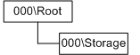
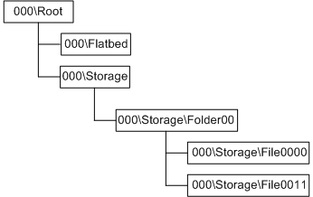

# Scanner Storage Architecture

Scanner devices that are equipped with one or more storage units should implement at least one root storage folder scanner item (WIA\_CATEGORY\_FOLDER) in their WIA item tree to represent either one individual storage unit or the logical root for all available storage units. Under a storage root item, there could be subfolder items (WIA\_CATEGORY\_FOLDER) that represent individual storage units (if all storage units are mapped under this unique storage root item) or file folders on a storage unit and individual file items (WIA\_CATEGORY\_FINISHED\_FILE).

**Note**   The root storage folder scanner items should be located directly off of the WIA root item. The root storage folder items may contain other folder items and files or it may be empty.

 

A scanner that is equipped with just an empty storage unit (for example, an internal hard disk drive that does not contain any data) should have a WIA item tree that looks like the following figure.

The preceding figure is a simplified graphic without a scanner item. A scanner will have at least one scanner item (flatbed, feeder, or film) and any type of scanner may be equipped with storage, as the following figure shows.

The preceding figure shows a WIA item tree for a scanner that supports flatbed platen scanning and a storage unit that contains one subfolder and two files.

 

 

