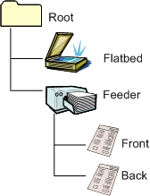

# Simple Duplex-Capable Document Feeder

Simple duplex scanning uses the same page settings for both front and back pages. Scanners that support duplexing should set the DUPLEX flag in the [**WIA\_DPS\_DOCUMENT\_HANDLING\_SELECT**](https://msdn.microsoft.com/library/windows/hardware/ff551384) property.

The following figure illustrates the WIA item tree of a flatbed scanner that supports simple duplex-capable document feeder scanning.

Note that the front and back of the page that is being scanned are represented by separate child items in the item tree. This differentiation includes separate categories in the [**WIA\_IPA\_ITEM\_CATEGORY**](https://msdn.microsoft.com/library/windows/hardware/ff551581) property: WIA\_CATEGORY\_FRONT and WIA\_CATEGORY\_BACK. In a scanner that performs basic duplex scanning, the front and back items will not be set separately; they will be set to the exact same values.

### Scanning

Applications navigate to the feeder item to perform document feeder scans. This item is where they will configure the number of pages to scan and the settings of each page and set [**WIA\_DPS\_DOCUMENT\_HANDLING\_SELECT**](https://msdn.microsoft.com/library/windows/hardware/ff551384) to the DUPLEX setting. A page corresponds to a single side of a document. Notice that scanning two documents results in four pages.

### Image Acquisition

In standard acquisition and folder acquisition, the WIA feeder item property settings are used for both front and back pages. For more information about standard acquisition and folder acquisition, see [Advanced Duplex-Capable Document Feeder](advanced-duplex-capable-document-feeder.md).

 

 

