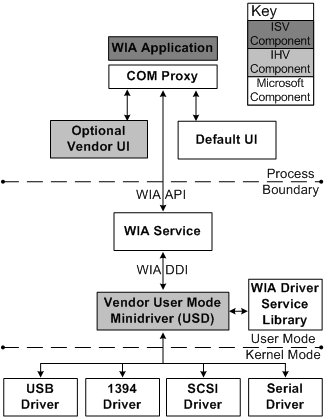

# WIA Architecture Overview

WIA is implemented as a Component Object Model (COM) out-of-process server to ensure the robust operation of client applications. 

WIA has three main components: the WIA service, the WIA driver service library, and a vendor user-mode driver.

-   The WIA service enumerates imaging devices, retrieves device properties, sets up events for devices, and creates device objects.

-   The WIA driver service library implements all services that are device independent.

-   The vendor user-mode driver maps WIA properties and commands to the specific device. There are two types of WIA vendor user-mode drivers:

    -   Minidriver: This is the most common type of vendor driver. It is a COM object that implements the WIA minidriver interfaces. A vendor can take advantage of all the WIA capabilities and features with this type of driver.
    
    -   Microdriver: This driver is much more limited than a minidriver and, therefore, simpler to develop. It is used primarily for basic scanner devices. This driver is not a COM object; it is a DLL that exports a few functions. Microdrivers cannot be used for camera devices.

The following diagram illustrates the WIA architecture.

### Imaging Applications

Imaging applications do not communicate directly with the minidriver, but communicate with the WIA service through the WIA application programming interface (API) to access images and acquire data from WIA devices. These applications can use a common, system-supplied user interface or a vendor-supplied user interface. For more information about the WIA API for imaging applications, see the Microsoft Windows SDK documentation.

### WIA Service

The WIA service is a system-supplied component that communicates with imaging applications and WIA minidrivers. The WIA service executes in a separate process from applications and in the same process as WIA minidrivers. Applications direct their device requests to the WIA service, which in turn directs the requests to the appropriate minidriver through the WIA device driver interface (DDI).

### WIA Driver Services Library

The WIA driver services library is a system-supplied component that provides helper functions for WIA minidrivers. A minidriver can call helper functions to perform tasks such as the following:

-   Initialize the WIA driver item tree.

-   Read, write, and validate device properties.

-   Transfer data.

Alternatively, a minidriver can perform such tasks itself. By taking advantage of the helper functions, you can reduce development time and the size of a WIA minidriver while still having the flexibility to develop individual solutions.

### WIA User-Mode Minidrivers

WIA minidrivers are vendor-supplied, user-mode components that direct WIA property changes and commands to an imaging device. A minidriver implements the WIA DDI, which is called by the WIA service to communicate with the minidriver.

A WIA minidriver implements the standard WIA minidriver interfaces. The minidriver communicates with the imaging device through a standard Microsoft Windows kernel-mode driver, such as the USB driver. The minidriver communicates with the kernel-mode driver by calling the [**CreateFile**](https://msdn.microsoft.com/library/windows/desktop/aa363858), **ReadFile**, **WriteFile**, and **DeviceIoControl** Win32 functions (described in the Microsoft Windows SDK documentation).

An imaging application cannot make direct calls to the WIA minidriver. Only the WIA service is permitted to call the driver directly.

### Kernel I/O Drivers

Kernel-mode still image drivers are system-supplied or IHV-supplied components that deliver data to or from the still image device. A kernel-mode still image driver is bus-specific.

Microsoft provides WDM-based, kernel-mode still image drivers for the USB, SCSI, and IEEE 1394 buses. See [Accessing Kernel-Mode Drivers for Still Image Devices](accessing-kernel-mode-drivers-for-still-image-devices.md) for more information.

A vendor must provide a kernel-mode still image driver *only* if its imaging device is incompatible with Microsoft-supplied, kernel-mode I/O drivers.

 
