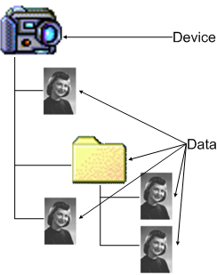
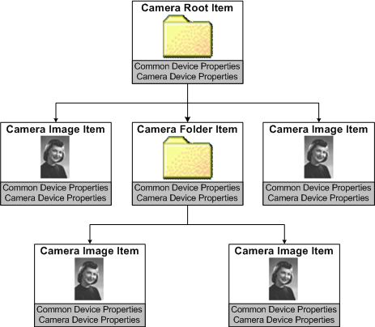

# WIA Camera Tree

The following figure shows a camera that contains several images, two of which are in the same directory.

In the following figure, WIA represents the camera shown in the previous figure, the pictures taken with the camera, and any folders as a tree of camera items.

The root item, which is the camera itself, consists of common device properties (properties that are common to both cameras and scanners), and camera-specific device properties. Similarly, each child item consists of properties common to both camera and scanner items, as well as properties that are specific to camera items.

Through the WIA service, an application can request the following from a camera item:

-   Query camera capabilities.

-   Set camera device properties.

-   Request a data transfer.

In the preceding diagram, the camera root item has three child items: two pictures and one folder. The folder has two child items that are both pictures. Camera items can also represent sound data or any other data on the camera that the device presents to the application.

 

 

