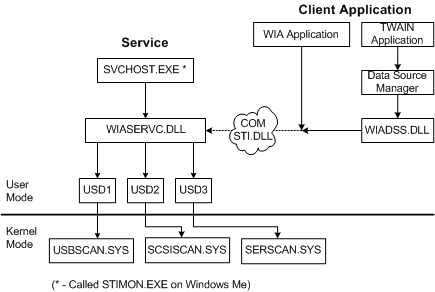

# WIA Core Components

## 

The WIA components for Windows XP and Windows Me are shown in the following figure.

The WIA Service (*wiaservc.dll*) is hosted by a generic host called *svchost.exe* in Windows XP and *stimon.exe* in Windows Me. *Wiaservc.dll* communicates with one or more user-mode still image drivers (labeled USD1, USD2, and USD3 in the figure), each of which communicates with a particular type of kernel-mode driver. Windows XP and Windows Me provide three types of bus abstraction: USB, SCSI, and serial ( *usbscan.sys*, *scsiscan.sys*, and *serscan.sys*).

On the client side, an application can be either a TWAIN-compatible application (see [Support for TWAIN-Compatible Applications](support-for-twain-compatible-applications.md)) or a WIA application. A TWAIN application calls into the data source manager, which in turn calls into *wiadss.dll*, a translation component that communicates with an instance of *sti.dll*. *Sti.dll* is a stub that communicates with the WIA service. In contrast, a WIA application makes calls directly to *sti.dll*.

Windows 98 and Windows 2000 do not support WIA. Their STI core components can be seen on [Windows 98 Core Components](windows-98-core-components.md) and [Windows 2000 Core Components](windows-2000-core-components.md).

 

 

[Send comments about this topic to Microsoft](mailto:wsddocfb@microsoft.com?subject=Documentation%20feedback%20%5Bimage\image%5D:%20WIA%20Core%20Components%20%20RELEASE:%20%288/17/2016%29&body=%0A%0APRIVACY%20STATEMENT%0A%0AWe%20use%20your%20feedback%20to%20improve%20the%20documentation.%20We%20don't%20use%20your%20email%20address%20for%20any%20other%20purpose,%20and%20we'll%20remove%20your%20email%20address%20from%20our%20system%20after%20the%20issue%20that%20you're%20reporting%20is%20fixed.%20While%20we're%20working%20to%20fix%20this%20issue,%20we%20might%20send%20you%20an%20email%20message%20to%20ask%20for%20more%20info.%20Later,%20we%20might%20also%20send%20you%20an%20email%20message%20to%20let%20you%20know%20that%20we've%20addressed%20your%20feedback.%0A%0AFor%20more%20info%20about%20Microsoft's%20privacy%20policy,%20see%20http://privacy.microsoft.com/default.aspx. "Send comments about this topic to Microsoft")

