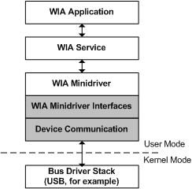

# WIA Driver Components

The WIA minidriver can be viewed as two logical layers:

-   The WIA service interface layer

-   The device communication layer

The following diagram illustrates the logical breakdown of a WIA minidriver and its components.

### WIA Minidriver Interfaces

A WIA minidriver is a COM object that implements the **IUnknown** COM interface and two WIA-specific COM interfaces: [IStiUSD](istiusd-com-interface.md) and [IWiaMiniDrv](https://msdn.microsoft.com/library/windows/hardware/ff545027). The WIA minidriver interface layer implements these interfaces and is the entry point into the WIA minidriver. Applications do not call the WIA minidriver interfaces directly; only the WIA service calls into these interfaces.

### Device Communication

The device communication layer is responsible for low-level interactions with the still image device through a kernel-mode bus driver. All interactions with the device are sent through this layer. This layer is responsible for packaging data to be sent to the device into a format that the physical device can understand, and for unpackaging data received from the device into a format that the driver understands.

This sections provides additional information about the WIA minidriver and its components in the following areas:

[WIA Minidriver Interfaces](wia-minidriver-interfaces.md)

[Device Communication through the Bus Driver](device-communication-through-the-bus-driver.md)

[WIA Components](wia-components.md)

 

 

