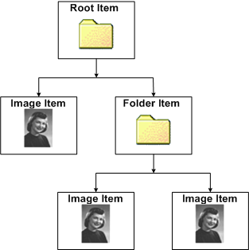

# WIA Driver Item Tree

In WIA, an imaging device is represented logically as a hierarchical tree of WIA items, as shown in the following diagram of a camera tree.

The root item represents the actual device, and the child items represent images or folders. Folders can contain images or other folders. Items have properties that the minidriver can set or query.

Going through the WIA service, an application uses an item to perform such tasks as getting and setting device information, controlling the device, and starting driver item enumeration.

Applications can call the [**IWiaMiniDrv::drvAcquireItemData**](https://msdn.microsoft.com/library/windows/hardware/ff543956) method to acquire data from an item by requesting a data transfer from the item.

 

 

